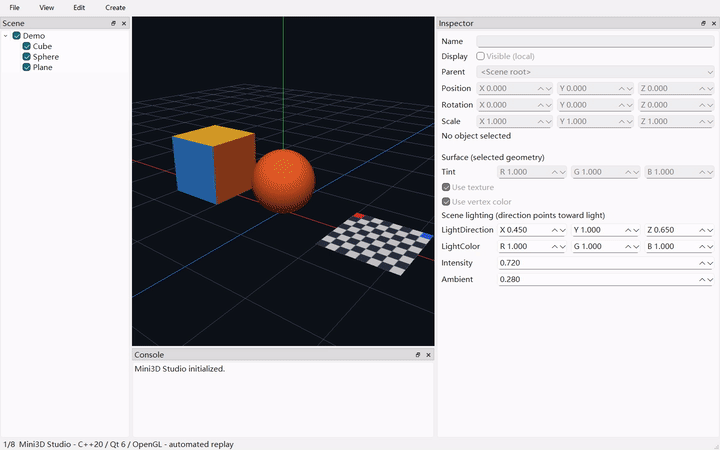

# Mini3D Studio

Mini3D Studio 是一个面向 Windows x64 的轻量级三维场景编辑器。V1 使用 C++20、
Qt 6 Widgets 与 OpenGL 4.1 Core，从零实现场景组织、静态 glTF/GLB 导入、对象选择与
变换、基础渲染、撤销重做和场景保存闭环，不依赖 Qt3D、Qt Quick 3D 或完整游戏引擎。

## 当前状态

已完成第七周功能，并推进第八周本地候选交付：新增百对象回归、Release 性能基线、
独立打包/验证脚本和演示视频。正式 `v1.0.0` 尚未达到发布门槛，见 [第八周验收](docs/week8.md)。
当前具备基础光照/材质、场景保存加载、未保存保护和完整场景编辑历史。
全面汉化已完成开发与本机回归：菜单、属性、标准对话框及应用提示默认简体中文；
保留用户名称和文件协议。中文输入、100%/200% 布局与隔离部署证据见 [汉化说明](docs/localization.md)。
文件 → 新建场景/打开场景/保存场景/场景另存为 支持 `.m3dscene`，保存层级、局部 TRS、实例外观、光照、
模型相对路径和自由观察视角；快捷预设与正交模式仅保留在当前会话，不写入文件。
Ctrl+N/O/S、Ctrl+Shift+S 对应四项操作。
属性面板下方可调整叠加色、纹理/顶点色开关及方向光。
已补齐独立相机/方向光实体：通过“创建”菜单创建，在场景树选中后编辑。
相机支持垂直视角、近远裁剪与只读预览；灯通过变换的旋转参数调整方向。
操作、单灯规则及格式 1 → 2 兼容性见 [Camera/Light 说明](docs/camera-light.md)。

高优先级六项交互优化已实现，操作与验收见 [交互优化说明](docs/interaction-optimization.md)。
选中对象后按 W/E/R 开关移动/旋转/缩放手柄；支持世界/局部坐标、平面移动及 Ctrl 临时吸附。
1/3/7 切前/右/顶视图，0 返回自由方向，5 切透视/正交。
GLB/glTF 可从资源管理器拖入中央视口；场景树支持拖动换父、中文右键菜单与搜索定位。
松开手柄提交一次变换，Esc 取消。Ctrl+Z 撤销，Ctrl+Y / Ctrl+Shift+Z 重做；Ctrl+D 复制子树，
Delete 删除子树。以上快捷键仅在场景树或视口焦点生效，不抢属性面板的文本编辑。
保留左键选择、橙色包围盒、F 聚焦、Ctrl+I 导入和属性面板的局部变换编辑。
Debug/Release 构建与各自 CTest 4/4 通过，200% 缩放下 UI 回归通过。
创建、导入、重命名、显隐、换父、TRS、材质、光照、复制和删除均可撤销。
打开/新建清空历史，保存不清空；相机导航不进入对象撤销链，但参与未保存判断。
资源不打包，移动项目须保持相对位置；场景文件与模型须位于同一盘符。
操作与限制见 [第七周验收](docs/week7.md)，导入子集见 [第四周说明](docs/week4.md)。
项目许可、全新机器及完整耐久验收仍待完成，尚不能宣称正式 V1 已发布。



[2 分 8 秒自动化演示](docs/media/mini3d-week8.mp4) · [性能数据与方法](docs/week8.md)

## 本地候选包

本机产物：`out/packages/Mini3D-week8-candidate-windows-x64.zip`。解压后运行根目录
`Mini3DStudio.exe`，打开 `assets/scenes/showcase.m3dscene`，无需 Qt Creator。
包和运行依赖已在本机新路径、净 PATH 下验证，但不等同于全新 Windows 系统验收。
此第八周候选 ZIP 和上方视频是补齐实体及汉化之前的快照，本轮没有覆盖；
体验新增实体须从当前源码重新构建，新保存的格式 2 文件不能用旧候选程序打开。
打包命令见 [第八周说明](docs/week8.md)，分发限制见 [第三方说明](docs/third-party-notices.md)。

## 环境基线

- Windows 10/11 x64
- Visual Studio 2022，安装“使用 C++ 的桌面开发”与 Windows SDK
- CMake 3.28 或更高版本
- Qt 6.8 或更高版本的 `msvc2022_64` 套件，包含 Translations 中的 `qtbase_zh_CN.qm`
- vcpkg Manifest 模式
- PowerShell 7

Qt 通过官方安装器安装；GLM、fastgltf、nlohmann/json、spdlog 与 Catch2 由 vcpkg
恢复。不要把 Qt 5 套件或 MinGW 套件传给本项目。

## 首次配置

方式一：在当前 PowerShell 会话中设置路径。

```powershell
$env:VCPKG_ROOT = 'D:/dev/vcpkg'
$env:QT_ROOT = 'C:/Qt/6.11.2/msvc2022_64'

cmake --preset windows-msvc
cmake --build --preset debug
ctest --preset test-debug
```

方式二：复制本机 Preset 示例并修改其中的两条路径。

```powershell
Copy-Item -LiteralPath '.\CMakeUserPresets.json.example' -Destination '.\CMakeUserPresets.json'

cmake --preset windows-msvc-local
cmake --build --preset debug-local
ctest --preset test-debug-local
```

## 运行编辑器

Qt DLL 需要在当前进程的 `PATH` 中。完成 Debug Build 后可执行：

```powershell
$env:PATH = "$env:QT_ROOT/bin;$env:PATH"
& '.\out\build\windows-msvc\src\editor\Debug\Mini3DStudio.exe'
```

更完整的安装、自检和故障排查见
[开发环境说明](docs/development-setup.md)。

## 文档

- [V1 范围](docs/scope.md)
- [架构约束](docs/architecture.md)
- [八周路线图](docs/roadmap.md)
- [全面汉化计划与验收](docs/localization.md)
- [开发环境说明](docs/development-setup.md)
- [第二周实现与验收](docs/week2.md)
- [第三周场景编辑与验收](docs/week3.md)
- [第四周静态模型导入与验收](docs/week4.md)
- [第五周拾取、高亮与聚焦验收](docs/week5.md)
- [第六周移动、撤销与对象管理验收](docs/week6.md)
- [第七周光照、材质与场景文档验收](docs/week7.md)
- [第八周候选交付、性能与发布门槛](docs/week8.md)
- [演示材料与复现](docs/demo.md)
- [第三方组件与候选包许可边界](docs/third-party-notices.md)
- [样例资源来源与许可](docs/sample-assets.md)
- [原始起步方案](Mini3D_Studio_V1_起步方案开发文档.md)
- [首周 Alpha 视口截图](docs/images/mini3d-alpha-viewport.png)

## 仓库布局

```text
Mini3D/
├─ assets/          # Shader、图标和经许可的样例资源（按里程碑创建）
├─ docs/            # 范围、架构、路线图与开发说明
├─ src/editor/      # 当前 Qt Widgets 编辑器应用
├─ src/core/        # Scene、EntityId、Transform 与 AABB/Ray 数学
├─ src/assets/      # glTF/GLB 解析、CPU 资源与路径缓存
├─ src/renderer_gl/ # OpenGL Viewport 与后续渲染实现
├─ tests/           # 纯 CPU、Assets、独立 GPU 与编辑器联动验收
├─ tools/           # 默认关闭的性能/回放工具和本地打包验证脚本
├─ CMakeLists.txt
├─ CMakePresets.json
└─ vcpkg.json
```

## 许可证

许可证尚未由仓库所有者确定。选定许可证前，不应把本项目视为已授权公开复用。
随附第三方样例按各自许可使用，见 [样例资源说明](docs/sample-assets.md)。
