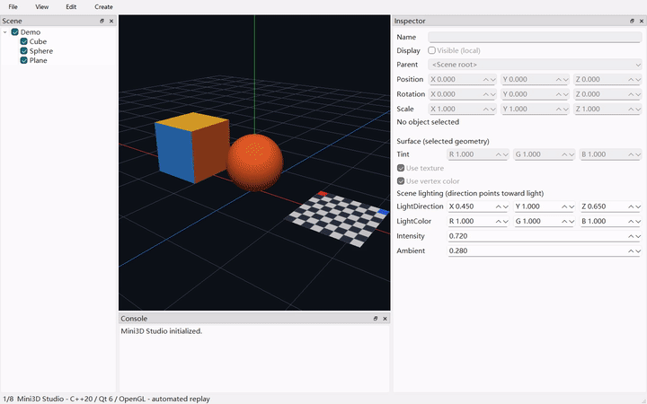

# Mini3D Studio

Mini3D Studio 是一个面向 Windows x64 的轻量级三维场景编辑器。V1 使用 C++20、
Qt 6 Widgets 与 OpenGL 4.1 Core，从零实现场景组织、静态 glTF/GLB 导入、对象选择与
变换、基础渲染、撤销重做和场景保存闭环，不依赖 Qt3D、Qt Quick 3D 或完整游戏引擎。

## 当前状态

通用API/MCP首版已完成本机Windows单用户及Codex CLI范围验收，47项工具覆盖现有有限建模、
修改器、场景/文件与有界批次。真实宿主已完成创建→内插/挤出→保存→Undo/Redo→重开→
图片观察闭环；普通启动默认关闭服务，正常编译仍只编主体。
操作见[运行说明](docs/api-mcp-runtime.md)，完整结果/限制见[最终证据](docs/validation/api-mcp-m7-20261006.md)。
Desktop当前聊天、跨用户及新机器未实测，编译时自动化裁剪开关未实施。

当前源码已完成 V2 R2 获授权的 P0/P1 功能开发、主要本机自动验收和候选交付；
当前源码 Release 已完成性能收尾，本机限定夹具三档通过原预算；人工实机与发布验收仍有缺口。
完整范围与逐项状态见 [二期计划](docs/v2-development-plan.md)，实际证据与未验收项见
[二期验收](docs/v2-acceptance.md)。
工作台、F3/Q 和单对象即时 G/R/S 已接通；已接通可编辑网格的场景/历史/渲染与最小格式 3。
已接通 Tab 单对象编辑、点/边/面点击与 Shift 多选、选区覆盖层及活动元素侧栏。
已接通 B 框选、X-Ray 和独立覆盖层开关；规则见 [组件框选](docs/v2-component-picking.md)。
组件 G/R/S 已接通独立预览、取消、历史与保存；见 [组件变换](docs/v2-component-transform.md)。
区域挤出已接通连通面域、独立预览、顶盖选择、安全取消与保存，见 [区域挤出](docs/v2-extrude-region.md)。
区域挤出支持 F9/左下“调整上一步”，修改世界 XYZ 位移并替换原历史，不累积挤出，见 [上一步参数](docs/v2-history.md)。
单个共面凸面支持 I 等距内插、局部厚度 F9 调整与安全取消，见 [面内插](docs/v2-inset-face.md)。
规则四边形带支持 Ctrl+R 单环切与滑移、右键居中确认、Esc 整次取消，见 [环切](docs/v2-loop-cut.md)。
点/边/面删除与 F 单环共面补面已接通，含选区恢复、撤销与保存，见 [删除与补面](docs/v2-fill-delete.md)。
3D 游标已接通表面/地面点击定位、N 面板世界坐标、游标到选择/原点；新基础体在游标创建。
默认 Shift+右键放置，或使用“编辑 → 3D 游标”；游标不标脏、不进撤销，仅随主动保存落盘，
见 [3D 游标](docs/v2-cursor.md)。三种枢轴（选择质心 / 活动元素 / 游标）和“选择到游标（保持偏移）”
已接入，方向空间独立，操作与限制见 [变换枢轴](docs/v2-pivot.md)。
G 移动支持步进/顶点吸附、可见目标高亮、源集排除及 Ctrl 临时反转；数字输入优先，
对象手柄仍使用步进，详见 [吸附增量说明](docs/v2-snapping.md)。
H 临时隐藏、Alt+H 恢复和小键盘 `/` 局部隔离已接通；隐藏不删几何、不改原显隐，
穿透选择/吸附/游标遵守隐藏规则，详见 [隐藏与局部视图](docs/v2-visibility.md)。
单轴镜像求值、中心边界合并和变换夹持核心已完成，详见 [镜像核心](docs/v2-mirror-core.md)。
Mirror 修改器卡片、实时求值、Clipping、应用/删除/撤销和参数保存已接通，
见 [镜像修改器](docs/v2-mirror-modifier.md)。
对象支持范围见 [编辑模式](docs/v2-edit-mode.md)。
当前写 3、读 1/2/3，旧工程首次升级须另存新路径。
实现边界与迁移规则见 [格式 3 说明](docs/v2-scene-format.md)。
文件兼容性与失败预览保护见 [兼容性检查](docs/v2-file-compatibility.md)。
“文件 → 导出所选为 OBJ”支持显式可编辑源/修改器结果，世界变换烘焙、Y-up、单位不变；
不改变工程或历史，不导出材质/纹理，详见 [OBJ 导出](docs/v2-obj-export.md)。
规则网格支持 Alt+左键 Loop、Ctrl+Alt+左键 Ring、悬停 L 连通片；极点停止，
选择不改历史，边界详见 [拓扑选择](docs/v2-topology-selection.md)。
Edit 的 `O` 比例编辑支持 Smooth 世界半径、Connected、G/R/S、滚轮与半径圈；
确认一次历史、Esc 恢复全部影响点，详见 [比例编辑](docs/v2-proportional-editing.md)。
边选择 `Ctrl+B` 单段闭合倒角，F9 调整同一宽度历史，见 [倒角](docs/v2-bevel-edge.md)。
修改器页支持 1–2 级四边网格 Catmull–Clark 与固定 Mirror → Subdivision，源笼仍可编辑，
见 [细分](docs/v2-subdivision.md)。倒角五边端面不能直接接启用的四边细分。
大纲下方支持单层集合：新建/中文命名、单对象移入移出、成员选择与显隐；删集合保留对象，
不改变父子关系或TRS，操作见 [集合管理](docs/v2-collections.md)。
`Z` 着色饼菜单、反引号视图饼菜单、材质/实体/线框真实显示已接通；
`Shift+R` 用当前对象和选区重复末端挤出/内插/倒角，新增历史而不是F9替换，
见 [饼菜单与重复上一步](docs/v2-pie-repeat.md)。性能收尾 Release 的 1万/5万/10万源点，
Visible/X-Ray选择、begin/preview API P95≤50ms，实际换帧P95≤100ms，完整样本与正确性均通过；
10万点预览API/换帧 P95 为36.73/52.88ms，可见框选45.55ms。
基础编辑仍建议每对象不超过 1 万源点，不能据此保证流畅；更大网格有规模提示。
完整数据与适用范围见
[性能说明](docs/v2-performance.md)。
默认键位已改为 Blender 风格，可通过“编辑 → 键位配置”切回 Legacy Mini3D；
本段说的是当前源码，不表示下方旧候选包和视频已更新。

性能收尾构建已重新通过 Release 完整 CTest 4/4；下述 Debug、DPI、Blender 与隔离 ZIP
证据保留收尾前来源，本轮未重新执行这些验收或覆盖候选 ZIP。

本机最终 Debug/Release 完整构建与 CTest 各 4/4 通过。最终构建的 S01–S12 联调在实际 Qt
DPR 1/1.5/2 下各 8 用例、1739 断言通过；实际候选 ZIP 已通过本机净 PATH、新路径隔离验证。
Blender 5.1.1 已实际复核 5 个 OBJ、Mirror 及有限二级 Catmull–Clark；固定参考 4.5.0
尚未实测。真实中文 IME、原生系统缩放与 mixed-DPI、新机器、30 分钟人工耐久及正式许可
仍有验收缺口，不把本机自动化通过写成全环境验收或正式发布。

F1 或“帮助 → 使用手册与兼容性说明”可打开 30 章、34 张真实截图的离线手册。
前 29 图保留各阶段来源，图 30–34 为本轮真实饼菜单和着色截图，详见
[手册来源登记](docs/user-guide-sources.md)。

已完成第七周功能，并推进第八周本地候选交付：新增百对象回归、Release 性能基线、
独立打包/验证脚本和演示视频。正式 `v1.0.0` 尚未达到发布门槛，见 [第八周验收](docs/week8.md)。
当前具备基础光照/材质、场景保存加载、未保存保护和完整场景编辑历史。
全面汉化已完成开发与本机回归：菜单、属性、标准对话框及应用提示默认简体中文；
保留用户名称和文件协议。中文输入、100%/200% 布局与隔离部署证据见 [汉化说明](docs/localization.md)。
文件 → 新建场景/打开场景/保存场景/场景另存为 支持 `.m3dscene`，保存层级、局部 TRS、实例外观、光照、
模型相对路径和自由观察视角；快捷预设与正交模式仅保留在当前会话，不写入文件。
Ctrl+N/O/S、Ctrl+Shift+S 对应四项操作。
属性面板下方可调整叠加色、纹理/顶点色开关及方向光。
已补齐独立相机/方向光实体：通过“创建”菜单创建，在场景树选中后编辑。
相机支持垂直视角、近远裁剪与只读预览；灯通过变换的旋转参数调整方向。
操作、单灯规则及格式 1 → 2 兼容性见 [Camera/Light 说明](docs/camera-light.md)。

高优先级六项交互优化已实现，操作与验收见 [交互优化说明](docs/interaction-optimization.md)。
默认键位的对象模式下，鼠标位于视口并选中对象后按 G/R/S 即时移动/旋转/缩放，W 返回选择工具；
Enter/左键确认、Esc/右键取消，支持数值、轴约束、Shift 精细和 Ctrl 临时反转吸附。
小键盘 1/3/7 切前/右/顶视图，小键盘 5 切透视/正交，小键盘句点聚焦选择；T/N 显隐面板。
Home 聚焦全部可见对象，小键盘 0 切换实体相机预览，再按一次或 Esc 返回原编辑视角。
Ctrl+Space 最大化当前区域/还原；“视图”菜单提供替代入口和快捷键重绑定，文本/输入法优先。
Legacy 保留 W/E/R 手柄、主键 1/3/7/0/5 和 F 聚焦。两套键位不混用，详见 [输入说明](docs/v2-input-operations.md)。
GLB/glTF 可从资源管理器拖入中央视口；场景树支持拖动换父、中文右键菜单与搜索定位。
松开手柄提交一次变换，Esc 取消。Ctrl+Z 撤销，Ctrl+Y / Ctrl+Shift+Z 重做；Ctrl+D 复制子树，
对象模式 Delete 删除子树；Edit 中 Delete 打开组件删除菜单，Blender 风格另支持 X。
Blender 风格按鼠标所在区域分发，Legacy 按视口/树焦点分发；文本/输入法优先。
保留左键选择、橙色包围盒、菜单聚焦、Ctrl+I 导入和属性面板的局部变换编辑。
Debug/Release 构建与各自 CTest 4/4 通过，200% 缩放下 UI 回归通过。
创建、导入、重命名、显隐、换父、TRS、材质、光照、复制和删除均可撤销。
打开/新建清空历史，保存不清空；相机导航不进入对象撤销链，但参与未保存判断。
资源不打包，移动项目须保持相对位置；场景文件与模型须位于同一盘符。
操作与限制见 [第七周验收](docs/week7.md)，导入子集见 [第四周说明](docs/week4.md)。
项目许可、全新机器及完整耐久验收仍待完成，尚不能宣称正式 V1 已发布。



[2 分 8 秒自动化演示](docs/media/mini3d-week8.mp4) · [性能数据与方法](docs/week8.md)

## 本地候选包与原生示例

API/MCP本机候选：[Mini3D-api-mcp-windows-x64-20261006.zip](out/packages/Mini3D-api-mcp-windows-x64-20261006.zip)。
最新Release、净PATH迁移、12包内依赖及实际ZIP清单已通过；外部Node为MCP先决条件，
无需Node也能普通运行编辑器。[最终包验收报告](docs/validation/api-mcp-m7-package-20261006.json)
与ZIP旁同名`.zip.validation.json`绑定同一SHA256；包内文档为打包前快照，未改写已测ZIP。
候选内容与操作见[候选包说明](docs/package-readme.md)。未持久安装用户MCP项，未公开发布或签名。
以下V2/第八周候选为历史产物，保持不变。

二期本机候选包：[Mini3D-v2-candidate-windows-x64-20261002.zip](out/packages/Mini3D-v2-candidate-windows-x64-20261002.zip)。
2026-10-03 已从实际 ZIP 解压并通过迁移目录、净 PATH 和不同工作目录验证，不是已发布下载。
[外部包验收报告](docs/validation/v2/final/package/report.json)与 ZIP 旁的 `.validation.json` 绑定同一 SHA256；
包内文档保留打包时快照，没有为加入验收报告而重打已测 ZIP。历史V2内容、操作与状态
以 [二期验收](docs/v2-acceptance.md) 为准，不将下述旧包当成2026-10-06 API/MCP产物。

当前源码可打开 `assets/scenes/v2/shell.m3dscene`、`symmetric.m3dscene` 和
`subdivision.m3dscene` 三份原生作品，先另存副本再继续编辑。源 OBJ、修改器求值 OBJ
和哈希清单随场景保留，来源、用法与许可边界见 [样例资源说明](docs/sample-assets.md)。

历史第八周本机产物：`out/packages/Mini3D-week8-candidate-windows-x64.zip`。解压后运行根目录
`Mini3DStudio.exe`，打开 `assets/scenes/showcase.m3dscene`，无需 Qt Creator。
包和运行依赖已在本机新路径、净 PATH 下验证，但不等同于全新 Windows 系统验收。
此第八周候选 ZIP 和上方视频是补齐实体及汉化之前的快照，本轮没有覆盖；
体验新增实体须从当前源码重新构建；当前写格式 3，新保存文件不能用旧候选程序打开。
打包命令见 [第八周说明](docs/week8.md)，分发限制见 [第三方说明](docs/third-party-notices.md)。

## 环境基线

- Windows 10/11 x64
- Visual Studio 2022，安装“使用 C++ 的桌面开发”与 Windows SDK
- CMake 3.28 或更高版本
- Qt 6.8 或更高版本的 `msvc2022_64` 套件，包含 Translations 中的 `qtbase_zh_CN.qm`
- vcpkg Manifest 模式
- PowerShell 7

Qt 通过官方安装器安装；GLM、fastgltf、nlohmann/json、spdlog 与 Catch2 由 vcpkg
恢复。不要把 Qt 5 套件或 MinGW 套件传给本项目。

## 首次配置

方式一：在当前 PowerShell 会话中设置路径。

```powershell
$env:VCPKG_ROOT = 'D:/dev/vcpkg'
$env:QT_ROOT = 'C:/Qt/6.11.2/msvc2022_64'

cmake --preset windows-msvc
cmake --build --preset debug
```

方式二：复制本机 Preset 示例并修改其中的两条路径。

```powershell
Copy-Item -LiteralPath '.\CMakeUserPresets.json.example' -Destination '.\CMakeUserPresets.json'

cmake --preset windows-msvc-local
cmake --build --preset debug-local
```

普通 Debug/Release 构建只编译主程序及其依赖，不编译测试。需要测试时单独执行：

```powershell
cmake --build --preset build-tests-debug
ctest --preset test-debug
```

本机 Preset 对应 `build-tests-debug-local` 和 `test-debug-local`。已有本机 Preset
不必覆盖重建，可使用 `cmake --build --preset debug-local --target mini3d_test_suite`。
测试配置保持 `BUILD_TESTING=ON`；`ctest` 只运行测试，不会替你编译测试程序。

## 运行编辑器

Qt DLL 需要在当前进程的 `PATH` 中。完成 Debug Build 后可执行：

```powershell
$env:PATH = "$env:QT_ROOT/bin;$env:PATH"
& '.\out\build\windows-msvc\src\editor\Debug\Mini3DStudio.exe'
```

更完整的安装、自检和故障排查见
[开发环境说明](docs/development-setup.md)。

## 文档

- [通用 API / MCP 详细开发指导](docs/api-mcp-development-guide.md) · [施工任务板与多 agent 协作](docs/api-mcp-task-board.md)
- [API / MCP 实际实施状态与内部调用](docs/api-mcp-implementation-status.md)
- [本机自动化启动与权限](docs/api-mcp-local-bridge.md) · [MCP 适配器启动](mcp/README.md)
- [当前现状与通用 API / MCP 扩展调研交接](docs/api-mcp-research-brief.md)
- [当前版本详细使用手册（HTML，含操作截图）](docs/Mini3D_使用手册.html)
- [二期开发计划与状态](docs/v2-development-plan.md)
- [二期联调、作品与验收证据](docs/v2-acceptance.md)
- [二期使用规模与性能](docs/v2-performance.md)
- [Mini3D 与 Blender 的兼容边界](docs/blender-compatibility.md)
- [V1 范围](docs/scope.md)
- [架构约束](docs/architecture.md)
- [八周路线图](docs/roadmap.md)
- [全面汉化计划与验收](docs/localization.md)
- [开发环境说明](docs/development-setup.md)
- [第二周实现与验收](docs/week2.md)
- [第三周场景编辑与验收](docs/week3.md)
- [第四周静态模型导入与验收](docs/week4.md)
- [第五周拾取、高亮与聚焦验收](docs/week5.md)
- [第六周移动、撤销与对象管理验收](docs/week6.md)
- [第七周光照、材质与场景文档验收](docs/week7.md)
- [第八周候选交付、性能与发布门槛](docs/week8.md)
- [演示材料与复现](docs/demo.md)
- [第三方组件与候选包许可边界](docs/third-party-notices.md)
- [样例资源来源与许可](docs/sample-assets.md)
- [原始起步方案](Mini3D_Studio_V1_起步方案开发文档.md)
- [首周 Alpha 视口截图](docs/images/mini3d-alpha-viewport.png)

## 仓库布局

```text
Mini3D/
├─ assets/          # Shader、图标和经许可的样例资源（按里程碑创建）
├─ docs/            # 范围、架构、路线图与开发说明
├─ src/editor/      # 当前 Qt Widgets 编辑器应用
├─ src/core/        # Scene、EntityId、Transform 与 AABB/Ray 数学
├─ src/assets/      # glTF/GLB 解析、CPU 资源与路径缓存
├─ src/renderer_gl/ # OpenGL Viewport 与后续渲染实现
├─ tests/           # 纯 CPU、Assets、独立 GPU 与编辑器联动验收
├─ tools/           # 默认关闭的性能/回放工具和本地打包验证脚本
├─ CMakeLists.txt
├─ CMakePresets.json
└─ vcpkg.json
```

## 许可证

许可证尚未由仓库所有者确定。选定许可证前，不应把本项目视为已授权公开复用。
随附第三方样例按各自许可使用，见 [样例资源说明](docs/sample-assets.md)。
