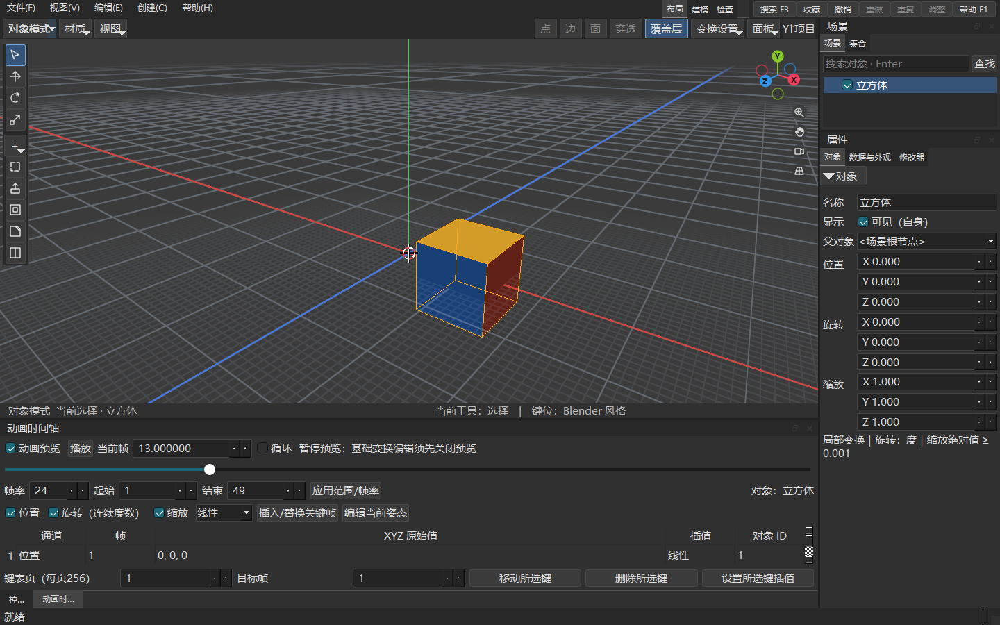
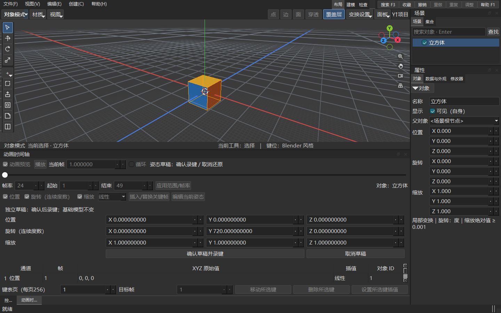

# Mini3D 原生动画使用说明

原生动画第一版用于对象、Empty、实体相机和方向光的位置、旋转与缩放。基础模型、保存的关键帧和当前预览彼此独立；播放不会把姿态写回基础模型。本文对应当前源码，不代表旧候选安装包已更新。

## 打开时间轴和示例

从“视图 → 动画时间轴”打开底部面板；默认收起，与控制台在同一区域切换。先保持对象模式，结束正在进行的变换或建模手势。

通过“文件 → 打开场景”打开[中立动画示例](../assets/samples/native-animation-neutral.m3dscene)。示例不依赖外部模型或纹理，共5个对象：移动父 Empty、独立旋翼转轴、长旋翼、短标记和地面。长短不同的两端便于区分朝向，旋翼部件没有单独轨道，仍继承父级动画。

打开后是基础模式，不会自动播放。勾选“动画预览”，点击“播放”；点击“暂停”后可修改当前帧。示例为24fps、1–49帧，父节点沿X移动0→10，转轴Y连续旋转0→720.000000001度。

| 当前帧 | 父节点局部X | 转轴连续Y角度 | 含义 |
| --- | --- | --- | --- |
| 13 | 2.5 | 约180 | 半圈，长端反向 |
| 25 | 5 | 约360 | 一圈，位置已前移 |
| 37 | 7.5 | 约540 | 一圈半，长端再次反向 |
| 49 | 10 | 720.000000001 | 两圈，精确末键 |

循环采用起止帧的半开区间，播放会从末端回到起始，不重复停留末帧；需要观察精确49帧时，先暂停再定位。首尾朝向相同不能单独证明转过两圈，要结合中途画面和连续角值。

## 认识时间轴

截图是本机真实窗口：当前预览帧13，右侧属性仍是基础值。它来自独立立方体交互夹具，不是上面的旋翼示例，也不是界面设计稿。

| 控件 | 操作及结果 |
| --- | --- |
| 动画预览 | 开启独立姿态；关闭返回基础模型。播放或草稿中须先暂停或取消 |
| 播放或暂停 | 按单调时钟前进；暂停保留子帧，不强制取整 |
| 当前帧与滑条 | 暂停时定位；字段支持子帧，滑条定位整数帧 |
| 循环 | 在基础或暂停状态切换，不在播放中修改 |
| 帧率、起始、结束 | 改字段后点击“应用范围/帧率”；范围缩小不删键，改帧率不移键 |
| 位置、旋转、缩放 | 每项是完整XYZ组，决定录入或草稿可编辑的通道 |
| 线性、保持常量 | 新录键的插值；也可用于键表“设置所选键插值” |
| 键表 | 只显示当前对象，按通道和帧排列，每页256键；双击一行定位该帧 |

帧率允许1–120，帧域1–100000。定义最多3000轨、总100000键、单轨10000键；一次API录键最多1024项。超过限制会明确拒绝，不提交一半结果。

## 制作一段两圈旋转

1. 在对象模式选中要旋转的对象。需要围绕转轴转动时，先在基础模式建立 Empty 父级、安放轴心并挂接部件；已有动画的子树不能直接换父。
2. 打开时间轴，设置24fps、起始1、结束49，点击“应用范围/帧率”。只勾选“旋转（连续度数）”，选择“线性”。
3. 当前帧保持1，点击“插入/替换关键帧”，记录当前旋转。此按钮记录当前可见姿态，不把它改成新值。
4. 勾选“动画预览”，暂停定位49，点击“编辑当前姿态”。
5. 本例起始Y=0，在草稿旋转组直接填写Y=720，X/Z保持所需值，点击“确认草稿并录键”。如果保留非零起始Y，末值应为起始Y+720，才是两圈。
6. 暂停定位13/25/37/49检查角度，再回到1播放。右侧常规属性不会变成动画角度。

草稿字段直接设置该通道在当前帧的局部值。截图中Y=720位于帧1，仅展示多圈字段；上面的制作流程要求把末键录到49帧。角度不折叠到0–360，不自动选择最短旋转方向：170→190是+20度，170→−170是−340度。

位置和缩放使用相同流程：先录起始值，再定位末帧，通过草稿填写末值并确认。位置字段是相对父对象的局部坐标，不是世界坐标。缩放每分量绝对值至少0.001；线性相邻键必须同号，不能从+1穿零到−1。需要离散跳号可使用保持常量。

## 草稿里的视口手势

草稿只允许当前勾选通道变化，未勾选字段禁用；确认是一条共享撤销历史，取消恢复正式求值姿态，不改基础TRS。

- `G`：世界空间移动，内部换算回局部位置；仅位置通道已勾选时可用。
- `S`：缩放倍率，以对象原点为中心；仅缩放通道已勾选时可用。
- `R X/Y/Z 数值`：在当前草稿连续角上增加角度。例如`R Y 720`增加720度；它与字段直接填720的“设置值”不同。第一版不支持自由轴鼠标多圈旋转。
- Enter或左键只结束这一次手势，仍须点击“确认草稿并录键”才提交关键帧。
- 手势中的Esc先撤销该手势；没有手势时Esc取消整份草稿。也可点击“取消草稿”。

草稿期间不能切选区、切帧、播放、导航、换模式或枢轴、保存及撤销；先确认或取消。切换面板输入焦点不会自动丢弃草稿。

## 修改关键帧和撤销

选中键表一行，填写“目标帧”后点击“移动所选键”；目标已占用时不悄悄覆盖。删除使用“删除所选键”，插值使用“设置所选键插值”。同帧新录入通过“插入/替换关键帧”显式替换。

XYZ是整体键，第一版不能只删除X或只给Y建独立曲线。保持常量使用左键的值直到下一键时刻，再精确切换；键外保持首末值。

Ctrl+Z撤销，Ctrl+Y或Ctrl+Shift+Z重做，与原建模共用唯一历史栈。播放、跳帧、纯取样没有内容历史；相同值不剪掉重做分支。复制子树会复制轨道并分配固定新对象身份；删除后Undo恢复原对象和轨道。

## 相机和灯光动画

从“创建”菜单创建实体相机或方向光，在时间轴录入它们的局部位置、旋转或缩放；父级动画也会作用于设备。

选择实体相机后用既有相机预览入口观察，可在动画预览中播放、暂停及暂停跳帧。设备方向采用刚性旋转，不从负非均匀缩放矩阵猜方向；退出实体相机预览恢复编辑观察视角。方向光的旋转改变照射方向，但第一版没有FOV、颜色、强度或可见性关键帧。

编辑观察相机与实体相机不是同一对象。播放本身不标脏；你主动导航编辑观察相机仍按原项目规则标脏，不进入对象历史。姿态草稿内不允许导航。

## 保存和继续编辑

暂停或关闭预览后使用Ctrl+S保存，Ctrl+Shift+S另存。当前源码写格式4、读1–4；旧1/2/3工程首次升级必须另存新路径，保留原稿。格式4不能交给只支持格式3的旧程序继续编辑。

保存内容是基础模型、正式关键帧和既有项目数据，不是当前临时预览、播放进度或草稿。打开/新建回到基础模式并清空旧会话姿态。资源仍按原相对路径规则处理。

暂停预览仍不允许基础TRS、网格、修改器、导入和OBJ导出；关闭“动画预览”再做。进入Edit或F9先显式回基础模式；播放中先暂停，草稿中先确认或取消。导出OBJ不是导出动画。

## 常见疑问

| 现象 | 处理 |
| --- | --- |
| 播放或定位按钮不可用 | 勾选动画预览，退出草稿，保持对象模式并结束旧手势 |
| 草稿按钮不可用 | 选中对象，暂停在整数帧，并退出实体相机预览 |
| 右侧属性没有随播放变化 | 正常，属性是基础值；动画姿态在时间轴和视口观察 |
| 填720后看起来没转 | 720与0终态朝向相同；查看中间帧及键表连续原值 |
| 修改基础模型被拒绝 | 先关闭动画预览；不要用基础属性修改动画姿态 |
| 拖动换父被拒绝 | 当前子树含直接动画轨道；基础模式也保留该保护 |
| 键不在播放范围内 | 关键帧不会因缩范围被删除；扩大范围或在暂停字段定位 |
| 文档、会话或截图版本过期 | API调用重新读取当前身份再操作，不能盲目重放旧CAS |

## 范围和参考

第一版不包含骨骼/蒙皮、IK、约束、逐轴曲线/Ease、自动插键、顶点/拓扑/材质/Shader动画、物理、NLA、视频或PNG序列导出。先用本中立样例学习对象动画，不会自动把既有城堡或基地拆件改轴。

[API与MCP调用](native-animation-api-mcp.md) · [格式4与旧稿保护](native-animation-scene-format-v4.md) · [实施和证据](native-animation-development-plan-20261007.md)

截图来源：`out/validation/native-animation-20261007-66e24b/r4-ui-debug-final-2245`，本机Debug真实Qt/OpenGL，DPR1，1440×900；主代理已查看。中立示例来源是正式API0.2/SDK/MCP真实建模保存，精确double保留。
