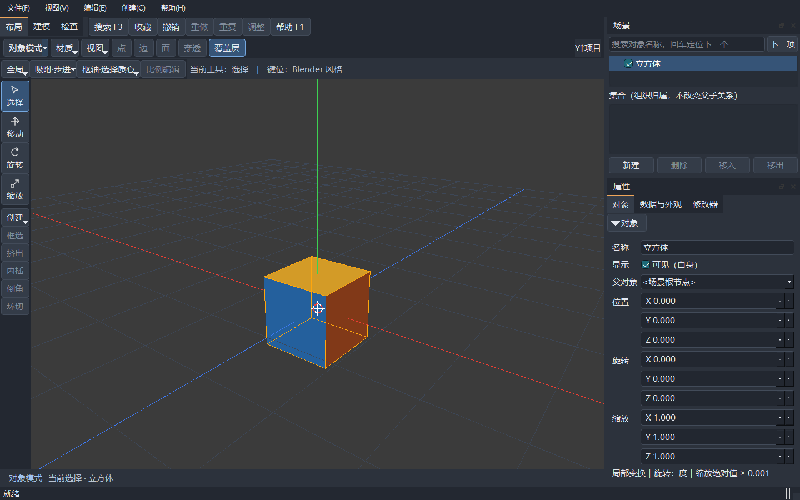
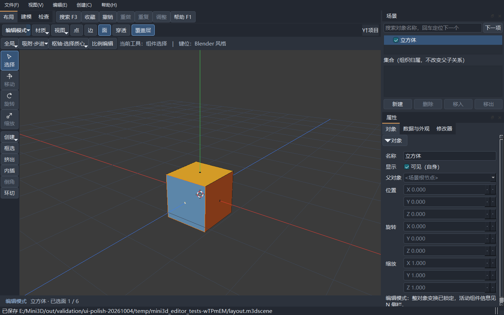
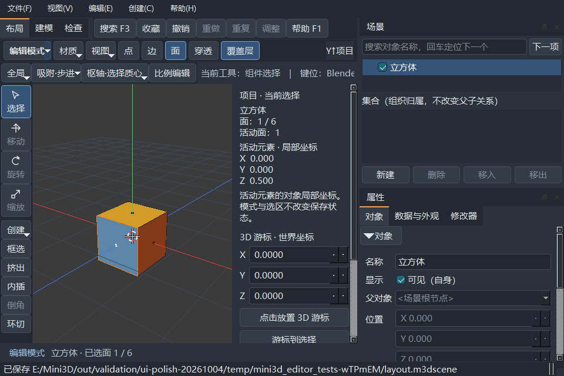

# 工作台界面与操作便捷性优化（2026-10-04）

本轮沿用 Qt Widgets / OpenGL 工作台，面向 Blender 式多边形建模。
界面入口复用原有动作、选区、预览和撤销链；建模算法、存档格式及修改器求值未改动。

## 当前操作

- 顶部模式按钮直接显示“对象模式 / 编辑模式”。点击文字区立即切换，右侧箭头打开原有模式与组件选择菜单；Tab 仍可切换。
- 第一行提供模式、着色、视图、点/边/面、穿透及覆盖层。第二行提供方向空间、吸附、枢轴和比例编辑，减少横向挤占。
- 左侧工具条显示图标与名称，增加创建、框选、挤出、内插、倒角和环切入口。不可执行的按钮随原有模式及选区规则禁用。
- 工作区标签旁提供搜索 F3、收藏、撤销、重做、重复、调整及帮助 F1。窄窗口中工具栏的扩展箭头承接放不下的入口。
- “更多工具”采用亮色标识；工具说明独立保留在控制行，窄窗口文字截短时可悬停查看完整内容。
- “重复”在当前选区新执行一次、增加历史；“调整”修改最后一次操作的参数。两者沿用既有范围和失败保护。
- 悬停按钮显示原操作说明及当前实际快捷键；键位切换后的菜单和按钮保持同一动作。
- 底部一直显示模式、当前对象及编辑选区数量；关闭 N 侧栏仍能看见选择反馈。长名称的完整文字可通过悬停查看。
- 场景搜索框与“下一项”并排，Enter 定位下一项的行为保留。属性分类改为横向“对象 / 数据与外观 / 修改器”。
- 深色面板、输入框、悬停、焦点与选中状态采用一致视觉层次；几何高亮与视口渲染保持原规则。

## 验证与证据

本轮最终源码的 Debug / Release 构建成功，完整 CTest 各 4/4 通过；
每种配置为 434 个用例、42,835 个断言。界面与两项既有回归的针对性运行通过 4 个用例、158 个断言。
实际新增按钮已覆盖模式切换、内插预览、Esc 取消、确认、重复、撤销重做及搜索取消；
960×640、1280×800 与再次缩小后的布局、OpenGL Context、历史和脏状态检查通过。
150% / 200% 的工作台、中文、帮助与 V2 回归各 18 个用例、2,049 个断言通过，
原生配方报告核实窗口及视口的实际 Qt DPR 分别为 1.5 / 2。

正式证据见 [本轮验证报告](validation/v2/ui-polish-20261004/report.json)。报告绑定源码与程序 SHA256；
原始构建、失败诊断及完整配方产物保留在 `out/validation/ui-polish-20261004/`。
工作区起始干净，基线为 `main / bee54d9`；本轮改动未提交。定向差异行格式检查和
`git diff --check` 已执行，核心建模、渲染、资源代码与基线一致。

回归中发现动作状态更新会恢复按钮长标题，挤动视口并安全取消操作；改用 Qt 原生
`QAction::iconText` 保持短标题，原模态断言通过。新视口尺寸下，几何基准帧仅在坐标轴与
几何交界处出现一个像素的深度栅格舍入差异；该几何测试关闭覆盖层，仍保留逐像素几何、
撤销、重做和重开断言。覆盖层及拾取另由既有回归验证，未更改渲染算法或取消保护。

最初构建的 AutoMoc / MSBuild 环境故障及阶段性未验收记录保留。
最终通过仅规范化当前子进程环境、禁用 MSBuild 节点复用（`/nr:false`）解决；
Qt 测试依赖通过官方 `windeployqt` 部署到测试目录，并为测试子进程指定已安装的插件目录。
未更改用户或系统持久环境、Qt 安装、权限或安全软件。

系统桌面前台输入及屏幕捕获曾返回 `screen grab failed`，未继续尝试绕过。
上述交互来自真实 Qt / OpenGL 窗口及 Qt Test 合成鼠标键盘，截图来自程序自身，
不代表外部鼠标键盘人工实测。实际跨屏仅覆盖相同 DPR，原生 mixed-DPI、中文输入法、
新机器、人工耐久和发布许可仍未验收；本轮未重跑 V2 性能专项三档预算。

## 实际界面

对象模式，工具名称、常用入口、横向属性分类及底部选择反馈：

编辑模式与选面反馈：

最小窗口与 N 侧栏，方向、吸附、枢轴和比例编辑仍位于上方：

## 本机运行

新本地包为 `out/packages/Mini3D-ui-polish-windows-x64-20261004/`，
运行根目录 `Mini3DStudio.exe`，或解压同名 `.zip` 后运行。保留 DLL、插件、assets 与 docs 的相对位置。
打包后的独立验收报告随 ZIP 外部交付为同名 `.validation.json`，以该实际报告为准；
包内文档是打包时快照，旧 V2 证据及旧候选包保持各自原来源。
程序内部版本仍为 0.1.0；本轮不提交、推送、发布或部署到外部服务。
