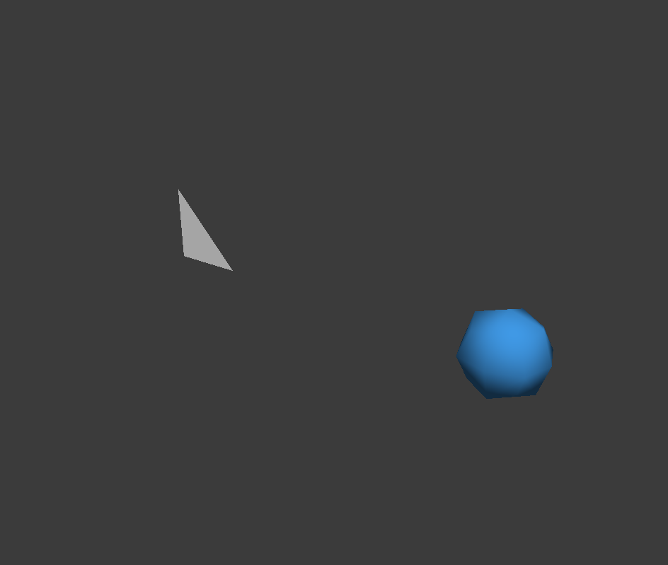

# M5-04 文件与文档 API 验收

日期：2026-10-06。基线：`5bfd37f8bcbadbd14d810d6bea0e7f50cfce4dc5`。结论：本机/官方SDK适用范围已验收，不代表跨用户、新机器或目标Codex宿主接入已验收。正式语义见[文件说明](../api-mcp-files.md)。

## 已完成

四方法file.save/importGltf/exportObj/document.new及open显式discard已接本体、统一codec、方法能力和MCP工具。saveAs始终NewOnly；覆盖权限为独立第三策略，旧二参数装配会清除覆盖授权。完整导入先准备后单步历史；OBJ源/求值均使用显式对象世界空间，不改变工程保存点。open/new失败保留原文档，成功才换身份、清历史。磁盘64MiB/128唯一路径、导入2048节点与候选预算、OBJ64MiB已统一公布。

file.read是方法权限：允许open/import改变本体，不是全局场景只读开关；缺scene.write仍拒绝entity.create/update/document.new。真实Bridge测试固定此合同，没有悄悄增加第二权限条件。

## 实际验证

原始日志/脚本根：`E:/CodexTemp/20261006/api-mcp-longplan-3e6a91bc`。均为实际执行，不把计划命令算作通过。

| 验证 | 结果与证据 |
| --- | --- |
| 最终文件专项 | 23用例/12,095断言全部通过，native exit 0；tests-m5-files-final.log，recheck-file-tests.ps1 |
| 集成Core新子树/受控写 | 18用例/3,029断言通过；tests-m5-files-core.log |
| 真实NewOnly祖先junction交换 | 1用例/323断言通过；tests-m5-reparse-newonly.log；save/saveAs/export实际拒绝越界，原字节与完整状态保留 |
| 真实file.read权限合同 | 1用例/41断言通过；tests-m5-permission-fixed.log |
| 受影响既有编辑器 | 初次118总数：115通过、1旧能力断言失败、2环境跳过；tests-m5-affected-regression.log。唯一失败修正后定点1用例/122断言通过，tests-m5-legacy-capability-fixed.log；没有声称同一次118全通过 |
| 资产回归 | 初次10通过/5跳过、321断言。给既有junction夹具后另2用例/28断言通过，tests-m5-files-assets-junction.log；其余3项符号链接创建受账户限制未实测 |
| TS与共享合同 | build/typecheck、专项5/5、全套41/41通过；45目录引用、9合法/19非法样例通过。saveAs显式false/true overwrite字段均拒绝 |
| 真实官方SDK | mcp-real-m5-files-e2e.mjs exit 0；real-m5-files-1791283537482/evidence.json passed=true，六阶段完成全部四方法、中文保存、源6面/求值24面OBJ、完整4节点导入单步Undo/Redo、越界buffer拒绝、discard/重开/旧句柄拒绝和匹配PNG/image |

主体和三个相关测试目标已成功构建，最后仅重构建editor_tests以复测夹具；普通主体构建不新增测试/Node依赖。Root已查看真实PNG，正式副本：

SHA256：`f80499fda0c900e74af06c548188784483a792ce2b4c0096baf4f6019e48dec2`。

## 失败证据与修复

- Core原准备矩阵左结合、运行期逆父链结合，对合法scale链产生不同溢出行为。实际red为1用例/15断言、4失败、exit42；只修prepareNewSubtree按真实localMatrix/完整父链顺序计算，green13用例/2,976断言、三变体定点1用例/23断言通过，最终集成见上表。未改旧worldMatrix/Transform。
- 实际SDK red在已有普通文件返回PATH_DENIED，合同应为OVERWRITE_DENIED。最小修复仅在当前独立replacement策略再次批准原路径、普通非symlink目标且overwrite=false时改错误分类；始终拒绝写入，不扩大权限。真实SDK green六阶段通过，Astra静态关闭。
- 测试按真实合同修正created.entityIds嵌套与严格missing路径先PATH_DENIED。合法纹理夹具补三组UV/TEXCOORD_0后保持CANCELLED预期；Bridge夹具补合法POSITION min/max。没有放松生产校验。
- QSaveFile暂存句柄打开时Windows拒绝移动祖先目录（ERROR_ACCESS_DENIED 5），未继续重复同样策略。祖先交换实测改用NewOnly。覆盖则另以不共享DELETE的真实目标句柄制造commit IO_ERROR，save/export overwrite=true全部guard批准后发布实际失败；原字节、完整状态与暂存清理测试通过。
- 旧测试以kind=file判断磁盘授权，与无需磁盘的document.new冲突；仅改为按file.read/file.write权限判断，定点通过。

## 审查与未验收项

未参与实现的Sol关闭Core矩阵P2并审查API/历史，未发现新的有证据P1/P2。Astra聚焦独立覆盖授权及错误分类；指出的missing预期和replacement真实IO证据缺口已由上述实测闭合。启动请求为Sol/max及Astra/high，底层provider路由未独立核验。

不宣称覆盖模式祖先交换已实测；不宣称图像解压/解析峰值受磁盘预算限制；不注入所有分配异常。3项受限symlink、目标Codex宿主直接图片、跨用户ACL和新机器部署仍未实测。本机junction与最终路径检查不是防御已控制同用户权限的恶意进程所有TOCTOU攻击的保证。未提交/推送/发布或修改用户MCP配置。

## 回退

保存最新定向diff后，只用apply_patch逆向M5-04方法/引用、独立覆盖策略、新子树与OBJ模式补丁；移出新增测试/合同前先移除CMake和Schema消费者。保留M1–M5-03及后续用户差异，不reset，不整体恢复Scene.*；progress仅追加回退说明。功能止损可不传自动化启动开关；此举不等于回退共用业务代码。
