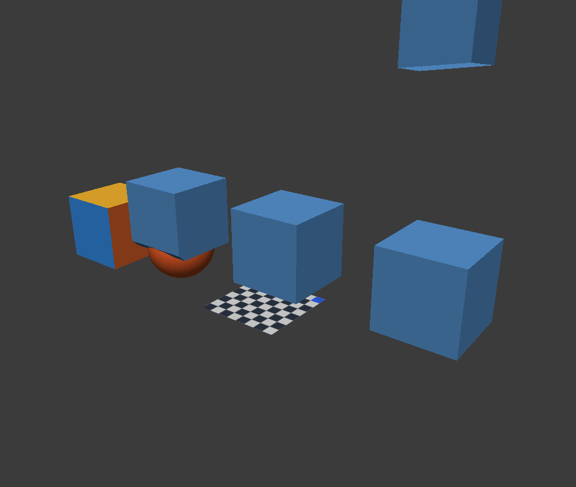

# M5-02 显式源网格建模验收

日期2026-10-06；API0.1.0/wire1；基线5bfd37f8bcbadbd14d810d6bea0e7f50cfce4dc5。仅本机批准根/同用户/串行应用线程，使用合同见[网格说明](../api-mcp-modeling.md)。

## 已完成与验收状态

六方法已验收：mesh.makeEditable/transformComponents/bevelEdge/loopCut/deleteComponents/fillFace。最终构建、真实SDK与预算回归通过；未参与实现的Sol定点关闭P2，未发现新增P1/P2。

操作明确源身份，不依赖GUI组件选择、吸附、比例编辑或交互镜像夹持。完整候选、结果和历史命令在最终守卫前准备，失败/no_change保留历史、redo、保存点及版本。成功不抢选择。原生Cube可转换；其余算子遵守现有Core拓扑边界，不扩展算法。

返回flat command+mesh身份及准确算子ID。源安装保守推进全部mesh版本，Undo/Redo不回退版本；ID保留不等于topologyRevision不变。世界组件变换经实际父链矩阵处理，不强行分解非均匀缩放父链为TRS。

## 构建与合同证据

产物根`E:/CodexTemp/20261006/api-mcp-longplan-3e6a91bc`：

- verify-m5-modeling.ps1最终退出0，主体/editor_tests构建成功；90用例/10,269断言全部通过，覆盖13个modeling-api用例、原网格/对象/API/共享历史及相关GUI算子。
- 首次构建仅新测试发生Catch宏三元表达式优先级和QJsonValueRef比较重载错误，修正测试表达式并显式toArray后通过；最终成功构建覆盖同名build-m5-modeling.log，实际首次错误保留在工具历史，不声称该日志保留首次失败全文。
- MCP独立build/typecheck及新5项、全套30项测试通过。共享6合法/24非法样例；单次映射/完整参数/稳定ID/1–6写序号、非法输入不连接桥、官方legacy/modern stdio及业务错误原样传递均通过。日志在`E:/CodexTemp/20261006/mini3d-m5-modeling-ts-a7328614`，mock不是本体几何证据。

## 真实官方SDK闭环

mcp-real-m5-modeling-e2e.mjs退出0，初次`real-m5-modeling-1791278514059/evidence.json`及最终共享预检修复后`real-m5-modeling-1791279735382/evidence.json`记录官方SDK2.3.1→真实stdio adapter→Mini3D；最新真实PNG也已实际查看：

- 全部六方法成功；负/非均匀父变换下world旋转、反射、缩放的实际坐标一致；identity/no_change及旧mesh版本拒绝。
- 反向边倒角、slide=0环切返回准确身份；删除精确差集后乱序完整边环补面；不完整环拒绝且状态不变。
- 单步Undo/Redo恢复准确源及准备身份；中文场景保存重开保留算子结果，旧document拒绝。
- 真实匹配帧PNG/image已实际查看；自有应用PID退出，不结束用户窗口。

正式PNG与原始副本SHA256均为`E20D27DDFAD332EA303ED8B6A5E62B2D87C5241A6560DDB95D5265EF592F2557`。图中为真实视口的默认对象和算子对象；solid图像不能肉眼证明环切源拓扑，拓扑由结构化断言验证，不把图片当成全部算法证明。

## 独立审查、限制与回退

未参与实现的Sol/max两波只读核对Schema/TS/文档及最终VM/API/codec/测试；发现P2为bevelEdge先分析再预算。主代理最终检查确认组件索引和offset=0挤出同类问题；GUI可以烘焙大源网格，不是假想输入。

新增合法10001顶点/4条边界边源回归：最初red 62断言/2失败，倒角错误为INVALID_TOPOLOGY而非LIMIT_EXCEEDED；扩展red 269断言/8失败，组件typed/wire六处先返回NOT_FOUND，零位移挤出两处成功。最终仅在validateMeshMutation目标及版本确认后新增3行共享源预算预检；保留所有候选预算，未改变Core/GUI策略。green主体/editor_tests构建成功，91用例/10,545断言全通过；原子状态、真实redo/clean、选区和guard未触发均有断言。日志为tests-m5-bevel-budget-{red,index-red,green}.log。

扩展red第一次执行因PowerShell条件输出把单目标数组解包为字符串，splat产生字符参数，CMake报m.vcxproj不存在；改为明确nativeArgs数组后构建成功，非业务缺陷。该失败保留build-m5-bevel-budget-argument-error.log，不与业务red混用。

独立Sol以最终VM哈希及基线no-index差异核对共享预检3行和7个回归SECTION，关闭P2；测试执行证据来自主代理，审查代理未重新构建。模型启动参数已指定，底层provider路由未独立验证。Codex宿主直接图片、跨用户/远程主机/新机器和真实网络卷未实测，本组不以SDK或单用户证据替代。未修改用户MCP配置，未提交/推送/发布；修改器/文件/批次/最终性能部署仍未完成。

回退：保存最新定向差异，用apply_patch仅逆向M5-02六入口、DTO/codec/service、共享准备命令helper、六目录项和TS合同/测试接线；移出新增ModelingApiTests和m5-modeling合同前先移除引用。保留M1–M5-01与后续改动，不全仓reset；重新构建主体/受影响独立测试，progress只追加回退说明。运行时不传--automation即可关闭外部服务。
