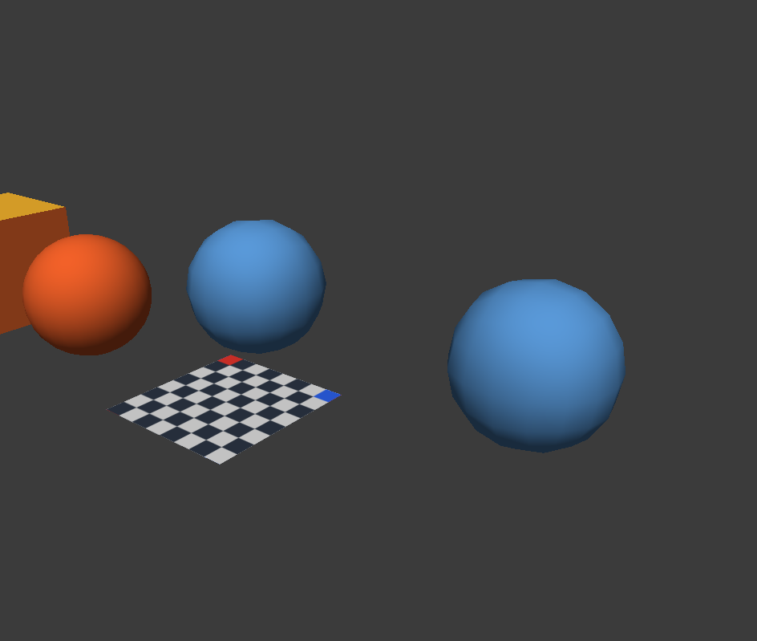

# M5-03 修改器 API 验收

日期：2026-10-06。结论：在本机/官方 SDK 范围已验收三方法及完整修改器状态；不代表 Codex 宿主直接接入、跨用户或新机器验收。[使用说明](../api-mcp-modifiers.md)。

## 实现与合同

`modifier.setMirror` / `setSubdivision` 接受完整参数或 null；同值 no_change。`modifier.apply` 允许已存在但停用的参数；不存在拒绝。固定 Mirror→Subdivision 链，应用 Mirror 仅烘焙自身并保留 Subdivision；应用 Subdivision 烘焙最终链并移除两者。返回 flat 命令/身份/完整参数；apply 始终 requeryRequired=true。

threshold 为有限非负 double，0 和停用时 1e300 均保留。源/拟定链在求值前核算，停用 Mirror 的恒等求值及映射也计入预算；准备后按真实容量复核。候选、返回容器与历史命令先准备，最终守卫后一次提交，Undo/Redo 回放同一准确快照。

## 实际验证

- `verify-m5-modifiers.ps1` 退出 0：主体/独立 editor_tests 构建成功；modifier-api/modeling-api/mesh-api/editor-api/history-editor/mirror02-editor/subdivision-editor 合计 **83 用例 / 11,721 断言**全部通过。日志 `E:/CodexTemp/20261006/api-mcp-longplan-3e6a91bc/{build,tests}-m5-modifiers.log`。
- `validate-m5-modifiers-contract.mjs` 退出 0：41 方法输入输出引用、9 合法/18 非法样例通过。
- TS build/typecheck、修改器专项 **6/6**、全套 **36/36**通过；两代官方 stdio 均为41工具。日志 `E:/CodexTemp/20261006/m5-modifiers-ts-8f10cb7a/{build,typecheck,narrow,all}.log`。mock 只证明合同和转发，不代替本体。
- `mcp-real-m5-modifiers-e2e.mjs` 退出 0；官方 client→正式 adapter→真实本体。证据 `E:/CodexTemp/20261006/api-mcp-longplan-3e6a91bc/real-m5-modifiers-1791281307420/evidence.json`：偏移 Cube 真源8点6面、镜像16点12面、二级最终192面；两种 apply 的单步 Undo/Redo 精确源 ID/数据；no_change/stale/不存在/非四边拒绝不改文档；停用修改器应用；中文保存重开与旧文档拒绝。
- 真实匹配帧 PNG / MCP image / SHA256一致，主代理已查看；下图是该次真实像素副本。截图中的启动示例不属于此次目标，结构/拓扑结论依赖上述精确断言。
- 两波未参与实现的 Sol/max 独立只读审查，无有证据 P1/P2；未单独注入内存分配异常。启动型号/强度已指定，底层 provider 路由未独立核验。

## 限制与回退

本轮不改 Core 算法、GUI 修改器规则或主体构建前置；未推送、发布或修改用户 MCP 配置。M5-04 文件、M6 批次与 M7 性能部署仍未完成。

回退先保存当前定向差异，只用 apply_patch 逆向三方法/DTO/codec/summary状态及对应 Schema/TS/CMake 接线；移出新文件前移除引用，保留 M1–M5-02 及后续修改。作者 before 副本在 `E:/CodexTemp/20261006/mini3d-m5-api-7ec693fd/m5-modifier-before`（扁平文件名），不是允许覆盖最新用户改动的全仓备份。重新构建主体与最小标签，progress 仅追加回退记录，不 reset。
