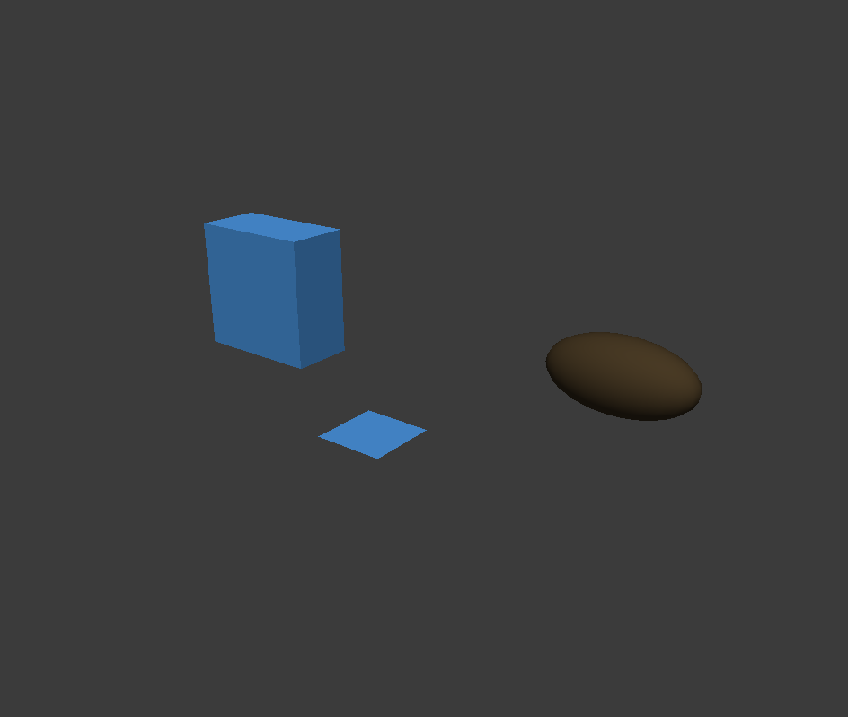

# M6 有界批次验收

2026-10-06；基线 `5bfd37f8bcbadbd14d810d6bea0e7f50cfce4dc5`，在保留 M1–M5 未提交差异的最终工作区验收。M6-01/02 已通过本机适用验证；不代表 M7 性能/部署完成。

## 实现与验证

- 两方法、47 静态工具；公共 Schema 4 合法/19 非法样例通过。1…64 完整项目、64 MiB 候选、明确已有父节点、唯一 TRS 目标，按最终 overlay 验证目标与后代真实几何边界。
- Debug 主体及独立 Core/editor 测试构建 exit 0。集成 Core **36 用例/3,928 断言**，`[batch-api]` **15 用例/1,969 断言**。原 Core 作者另有 Debug prepared 合并 **29/3,812**、Release 批次 **11/783**；不累加为同一轮总数。
- TS 专项 **10/10**、全套 **46/46**、typecheck 通过，mock 只证明适配器合同。新 Release 主体构建 exit 0；构建前后测试 exe/PDB 大小与时间未变化，普通构建仍只编主体。
- 创建/变换/结果/唯一历史在最终守卫之前准备；守卫后复核文档、版本和整组来源。一次历史、选择不变；全同值零历史/通知，不删 redo、不移动保存点。精确 before/after 回放不重跑算法、不替换整个 Scene 或几何来源代际。

## 可恢复分配失败与独立审查

Core 独立 Release probe 逐点注入创建 **39**、TRS **16** 次分配故障，含末次分配；场景、几何身份与旧快照可信性保持。Debug/Release 各 **16** 次创建/TRS 预检、安装、收回/恢复往返的 `operator new` 次数为零。曾发现候选移入 optional 时 map 可能分配、提前消耗编号，已修为返回值完整构造后提交编号并重验。

API 独立 Release `/MD` harness 链接此次新库：创建 clean/dirty 各 **52** 点、TRS 各 **26** 点、no_change 各 **23** 点，共 **202** 次单点失败均返回 LIMIT_EXCEEDED，escaped bad_alloc=0；逐次验证 scene/assets 身份、序列化内容、redo 命令指针、历史/clean/dirty、选择、两版本、mesh content/三版本、旧几何快照及零通知。最终守卫用 DEADLINE_EXCEEDED 拒绝，未进入 Qt push。API 后续准备失败产生内部编号空洞符合合同，不返回失败 ID。

独立 Sol 只读审查未发现有证据的可操作缺陷。实际 SceneTreeModel/QTreeView 内联草稿重置及 TransformInspector 刷新探针 exit 0：没有额外 GUI 历史或选区丢失，TRS 通知均看到整组最终值。指定 Sol/max 启动参数，底层 provider 未独立核验。

## 官方 SDK 真实闭环

Node **24.13.0**、SDK **2.3.1**、Qt **6.8.3**、MSVC **14.40.33807**、API **0.1.0**/wire **1**，实际协商 `2026-07-28`。`mcp-real-m6-e2e.mjs` exit 0，验证：

- 四完整基础对象输入顺序、一条历史、整批 Undo/Redo。
- 父/子最终 overlay、仅明确改变目标、三次精确往返、no_change 完整状态保持。
- 干净保存点且已有 redo 时，后项非法父、重复目标、世界溢出全部无残留；原 redo 仍可执行。
- 64 项合法、65 项拒绝、中文保存重开精确一致、历史清空、文件哈希保持。
- 真实 `image/png`、文档/视图/帧/上下文与 SHA256 一致，主代理已看图。

PNG **944×799**、15,052 字节，frameId **30**、contextGeneration **1**；SHA256 `b575e8e497a10465959ef3e96b2b1987fe5aa2c9eaa89e5bfcdd2041c8d556a1`。

## 原始证据与限制

主集成根 `E:/CodexTemp/20261006/api-mcp-longplan-3e6a91bc`：`verify-m6-integration.ps1`、`tests-m6-core.log`、`tests-m6-batches.log`、`build-m6-release.ps1`、`mcp-real-m6-e2e.mjs`；真实成功目录 `real-m6-1791287166457`。Core `m6-core-23d1d8f3`：`allocation-Release.log`/`allocation-Debug-playback.log`；API `mini3d-m6-api-adb8d543/api-allocation`：`run.ps1`/`allocation-Release-all.log`；独立审查 `m6-independent-review-c74e91aa/verify.ps1`；TS `m6-mcp-tests-0abb3de2`。

初次真实截图失败为 CAPTURE_TIMEOUT；独立 capture-only/原生只读窗口检查发现隐藏启动的验收实例无可见窗口。改为仅显示自建 GUI 后通过，命令行助手仍隐藏、只结束自有 PID。没有修改生产捕获行为以规避失败。

Debug 准备第 0 次故障注入触发 MSVC STL noexcept 构造内的代理分配并退出 3，因此可恢复故障证据用 Release，而不是重复 Debug 等价注入。故障 harness 覆盖 C++ new/aligned-new 准备期；Qt 内部 malloc/QUndoStack push OOM、进程崩溃/断电不在事务恢复承诺内。无 Git 提交/推送/发布；跨用户/新机器未实测。Codex CLI 图片门禁另见[宿主证据](api-mcp-codex-cli-host-20261006.md)。
