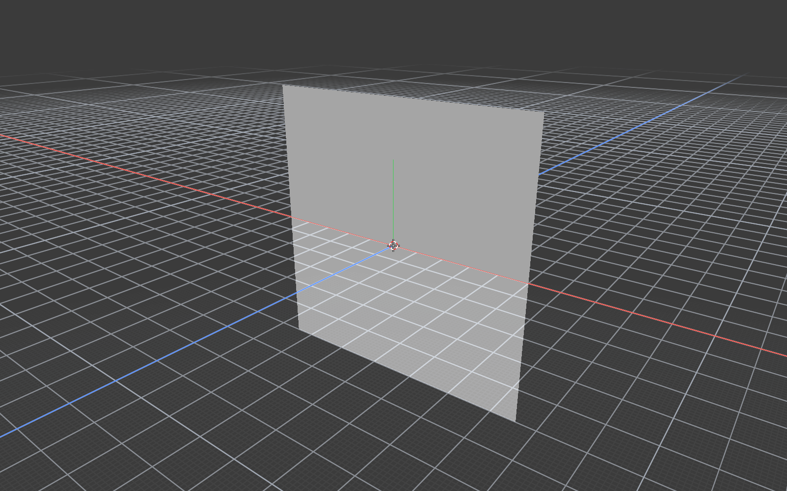
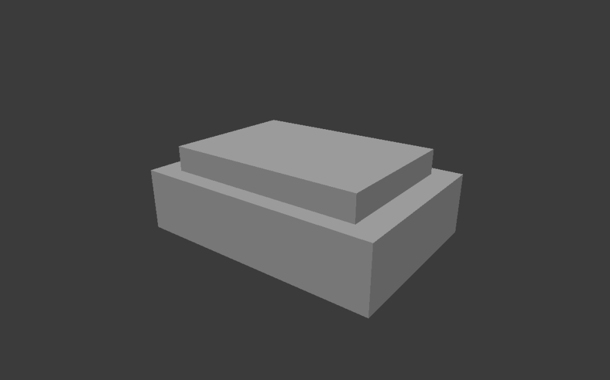

# M7 性能、部署与最终回归证据

日期：2026-10-06。源码基线 `5bfd37f8bcbadbd14d810d6bea0e7f50cfce4dc5`，包含本轮未提交的 M1–M7 实现。
API 0.1.0、私有 wire 1、47项工具；Qt6.8.3、Node24.13.0、官方 SDK2.3.1。
本记录不代表公开发布、当前 Desktop 聊天安装、跨用户或新机器验收。

## 当前结论

M1–M7首版本机Windows单用户及Codex CLI适用范围已验收：摘要优化、固定MCP产物、
性能定标、偏好隔离、完整回归、最新Release包迁移和宿主实际建模/图像闭环均已完成。
正式汇总见[最终包验收JSON](api-mcp-m7-package-20261006.json)，不把下文未实测条件写成通过。
最终包内文档是打包时快照；最终包结果应以 ZIP 外同名 `.validation.json` 和本记录后续结果为准。

## 摘要热点与兼容性

原递归 JSON 编码对每个标量创建临时文档/数组，是 10k 创建入队前的主要热点。
改为一次完整 Compact 编码，方法名、规范参数、SHA256及非法领域参数回退不变。
旧实现仅保留为测试参考，逐字节/hash比较 Unicode/转义/代理码元/key排序、数组及数值边界。
独占 Release 修改前后各18用例/584断言通过；独立审查指出三处正向 decode 夹具应先断言解析成功，
Root已补充，纳入最终集成回归，不将它们仅凭两份空对象相等视为可靠验证。

正式管道创建，预热排除、每档 n=20，单位 ms：

| 源点数 | 旧 median / p95 | 优化后 median / p95 |
| --- | --- | --- |
| 1k | 60.752 / 68.699 | 33.041 / 35.124 |
| 10k | 635.139 / 699.419 | 357.527 / 469.731 |

阶段计时、只读100k、截图和持续资源证据见[性能说明](../api-mcp-performance.md)及
[紧凑汇总](../performance/api-mcp-m7-20261006.json)。不把往返时间等同 GUI 阻塞，
不把不同请求的阶段分位数相加，不把旧裁切图与新聚焦图直接比较性能幅度。
Root查看真实1600×1000聚焦图，完整灰色四边平面位于画面中，无裁切，网格/轴覆盖按实际视图呈现；
SHA256 `0df16e595636106ce09d241bb426bf2a01b29a643571a7bb113ced1d8405df09`。
这不是1600×1600最大像素验收或复杂角色视觉验收。

## 固定产物与迁移前置结果

固定 adapter 清单1283文件、13,596,557 payload bytes、9项锁定生产依赖、47输入/输出Schema。
Package-Mcp/Test-McpPackage exit0，legacy2025-11-25和modern2026-07-28查询与image通过。
已有输出、已有验证目录及篡改Schema三项预期拒绝。无descriptor模式只验证静态完整性/Schema/缺描述启动拒绝。
候选 `E:/CodexTemp/20261006/mcp-package-6dc617a4/candidate`：
manifest SHA256 `42226D62706B858221AEE1F1FBC61C3ACF1AAE7A3F312863D0D217A2E8885936`，
compatibility SHA256 `59DF9A8790509BD27397E54BAA3592D067B77649A04DF107AA259C6026DE9B66`。

优化前本体包已通过净PATH迁移、demo/showcase/三个V2场景及missing拒绝、离线手册/图片和12包内DLL检查，
含Qt6Network；包内adapter真实M6四事务/中文重开/PNG通过。它不是最终优化后包。
只给descriptor、只给enable、关闭时给root的三项对照各exit10，无描述文件。

## 显式验收偏好隔离

观察到 MainWindow正常关闭会保存布局/键位/收藏偏好，新增显式
`MINI3D_VALIDATION_SETTINGS`，仅验收进程设置时使用独占目录的INI；普通启动行为不变。
不存在或相对目录两项各exit12；已有绝对目录exit0并产生真实PNG和INI。
仅本项目HKCU键的31个值指纹前后相同，不记录偏好原值、不修改注册表：
`F164E1A9706E50624CCB6AC508D5BD8CCC9D4767692C0FE23B7FCE5A5D907078`。
早期自建GUI没有对应注册表前置快照，不能宣称它们未写编辑器偏好，亦不猜测恢复。
之前两份 config.toml哈希不变证明的是 Codex配置，不是早期编辑器偏好。

## 最终回归中发现并修复的问题

第一轮完整Debug：unit/assets/gpu三组通过，editor412用例中406通过、3失败、3环境跳过。
两项是GUI包装复用API后丢失既有中文错误提示，恢复GUI入口校验；另一项是M6新增批次后过时的describe数量断言。
原GUI两个回归测试保持字节不变，不能用放宽测试掩盖回归。
失败原始日志 `E:/CodexTemp/20261006/api-mcp-longplan-3e6a91bc/regression-m7/ctest.log`。

原3失败专项3用例/66断言全过；相关文件/本地化/API/批次61通过、1环境跳过，14,567断言全过。
随后完整editor seed981835654：401通过、8失败、3跳过；原3失败已关闭，
新失败均是鼠标事件后未产生预期变换/选区（第一轮seed2002400670时这些通过）。
随后以最小复现定位共同状态，不通过随机重跑全套掩盖差异。
第二轮证据 `E:/CodexTemp/20261006/api-mcp-longplan-3e6a91bc/regression-m7-editor-final/ctest.log`。

根因是 `NavigationApiBusyTests` 首例在Esc、失焦和隐藏取消后遗漏三次QtTest中键release，
业务取消不会释放合成按钮，后续左键变成Left|Middle=5而不能通过既有单左键条件。
干净原8用例在同seed全部通过；加入污染前置例后，原8在同一行号失败。
只为夹具配对三次release并检查末尾NoButton，原业务取消断言仍在release前，
生产交互规则及原8用例断言不变。修前9例1通过/8失败，修后9通过/1,025断言，
导航专项3通过/28断言；Debug增量构建exit0。
证据与定向原样回退点在 `E:/CodexTemp/20261006/api-mcp-longplan-3e6a91bc/mouse-gui-diagnosis-f891a2c0/`。

独立TS最终typecheck及46/46通过、0跳过，exit0。
首次临时harness漏建MockBridge要求的父目录，最小复现确认为mkdtemp/ENOENT；
按PID/父链确认后只停止自有挂起test runner及子进程，补建独占父目录后成功，不修改adapter代码。
证据 `E:/CodexTemp/20261006/api-mcp-longplan-3e6a91bc/regression-m7-ts-corrected/`。

## 修复后的最终完整回归

`run-m7-cpp-final.ps1` exit0：三组CTest 3/3通过，再直接执行完整editor，
使用原失败seed981835654；不是单次四组CTest，也不是只重跑原失败项。

| 组 | 通过 / 跳过 | 通过断言 |
| --- | --- | --- |
| unit | 205 / 0 | 37,749 |
| assets | 44 / 5 | 1,015 |
| gpu | 8 / 0 | 352 |
| editor（完整同seed） | 409 / 3 | 40,544 |

全部执行项通过，跳过项不能算已验收：缺少符号链接创建权限、显式junction夹具、
已有网络映射盘及可访问的FAT/exFAT卷。junction专项的此前隔离证据另见M3/M5文件记录。
最终日志在 `E:/CodexTemp/20261006/api-mcp-longplan-3e6a91bc/regression-m7-cpp-final/`，
包含ctest.log/ctest.xml/ctest-detailed.log/editor.log；TS最终46/46/typecheck结果沿用上节，无新adapter改动。

`build-m7-final-release.ps1` exit0：最新GUI提示修复已纳入Release主体，
独立测试exe/PDB大小和时间前后相同，没有因主体构建编译测试。
最终exe SHA256 `2743A991B4E8692D724047349BE0D040C2C2BAA73E5D6E0019FABEBA285934E2`。
摘要源码SHA与性能测量一致；最新UI库含GUI提示修复，与性能测量快照的UI库不同，
不冒称最新exe已重跑性能。哈希及日志为同任务根下 `build-m7-final-release-*`。

## 最终成套包、实际ZIP与真实SDK

本地候选 `E:/Mini3D/out/packages/Mini3D-api-mcp-windows-x64-20261006.zip`，
87,332,802字节；SHA256 `F33E8D4FA13243FDA5FAE3B28F512E0FF86F4261E7E801F5D18E12883E1EDE29`。
ZIP旁 `.zip.validation.json` 与上方正式JSON字节相同；没有为加入后验收结果改写已测包。
`run-m7-final-package.ps1` exit0：净PATH迁移demo/showcase/三V2场景、missing预期拒绝、
离线手册/图片和12项DLL实际来源通过，含Qt6Network；迁移exe与最新Release SHA一致。
`verify-m7-final-zip.ps1` exit0：从真实ZIP新解压，整包2233项、adapter1283项逐字节数/hash通过。
普通关闭/不完整自动化参数对照沿用前置结果；main开关代码与当时一致，不冒称重新跑该对照。

迁移目录 `E:/CodexTemp/20261006/api-mcp-longplan-3e6a91bc/package-m7-final-relocated/relocated app`。
现代官方SDK2.3.1/2026-07-28经包内adapter，净应用PATH完成四阶段批次/失败零副作用、
精确Undo/Redo、64/65边界、中文保存重开和真实PNG，exit0。
Root查看蓝色长方体、棕色椭球和蓝色平面完整显示，深灰背景，无覆盖。
证据 `real-m6-1791293521244/evidence.json`，PNG SHA256
`91efcf0f1938d9d46a391ed6b3cb979a1d2085331b776862b56664425e6c1d80`。

## Codex CLI直接建模与图片观察

Codex CLI0.159.0，仅临时专用服务器工具白名单、已批准的本机隔离读写根，
创建cube→makeEditable→源分页识别+Y顶面→内插0.1→local[0,0.4,0]挤出→聚焦/orbit→
中文saveAs→撤销挤出/源摘要→重做/源摘要→保存点恢复→重开→真实capture/image说明，exit0。
撤销后12点10面，重做及重开16点14面；Root的独立SDK后置断言确认一个对象、
正确TRS、clean、historyCount=0，工程SHA256
`52278517437dd9dac94ec2a89df4dca3cd0434d829adfda8bec63a5518a6b328`。
模型三次不符合Schema的工具参数被拒绝，修正后完成；没有为此修改本体或adapter。

第一轮专用服务器使用auto时，CLI审批策略never拦截entity.create；空文档/历史保持，
未进入本体领域写入。根据[官方MCP配置说明](https://learn.chatgpt.com/docs/extend/mcp?surface=cli)，
仅该临时白名单服务器改为用户已批准的approve，一次有证据的修正后通过；不改全局审批或sandbox。
初次失败证据 `codex-host-1791293537968/failure.json`，成功证据
`codex-host-1791293754590/evidence.json`及mcp-audit/cli-events/visual-report。
完整审计未调用其他服务器或Shell/文件编辑类工具。已有两个config.toml前后hash相同，
单次`-c`配置随CLI进程结束失效，无持久项需要删除；未重启Desktop或共享后台。
最终所有隔离验收之后，本项目HKCU31值偏好指纹仍与前置记录一致。

Root复核真实1000×624图：灰色宽扁底座、居中矩形凸台、周围完整台阶，
solid下顶面明亮/侧面较暗，深灰背景，无网格/坐标覆盖；工程保留蓝色tint，
不能把solid灰色误判为外观数据丢失。模型对工具image的说明与实际图相符。
frameId19/contextGeneration1，PNG20,865字节，SHA256
`0a6a41ab86ac847c874c6679d2f3ba1536a90f2d3cc7123b0cb8845a3e93ce68`。

## 使用与尚未验证条件

启动、明确权限、未知结果恢复和关闭服务见[运行说明](../api-mcp-runtime.md)。
普通构建仍只编主体；测试/Node不作为前置条件。服务默认关闭，不远程监听、不增加建模线程。
原拟编译时自动化裁剪开关未实施，运行期关闭不等同编译裁剪；该开关不属于当前M7任务卡门禁。
本机单用户与CLI适用证据不替代跨用户ACL、全新机器、Desktop当前聊天热接入、
原生mixed-DPI/IME、30分钟人工耐久、签名/许可发布或崩溃/断电恢复。
子代理启动请求Sol/max；底层provider路由没有独立回显，实际型号不能以角色名证明。
本轮未提交、推送、发布或持久添加MCP配置，也未恢复牛高达作品任务。
