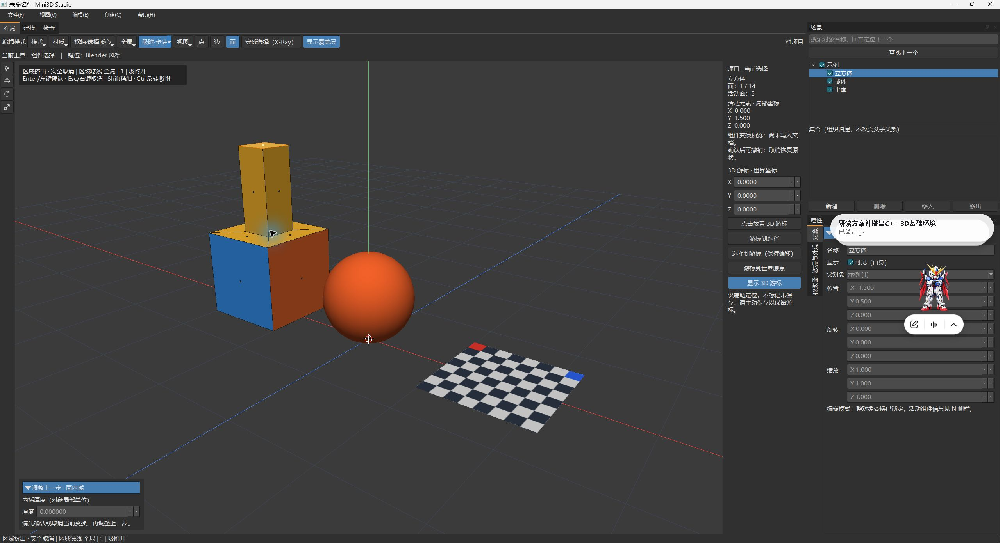
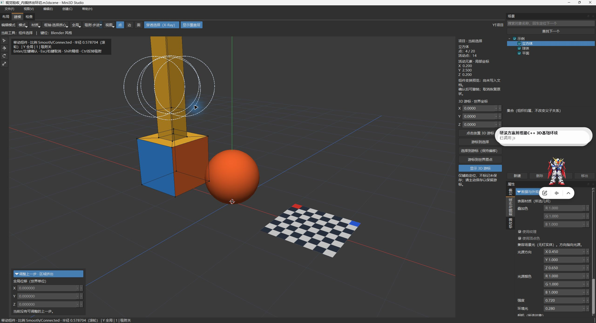
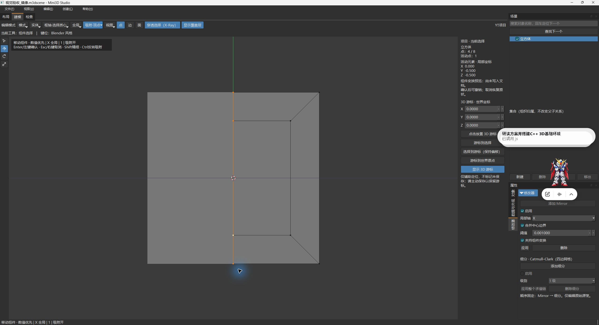
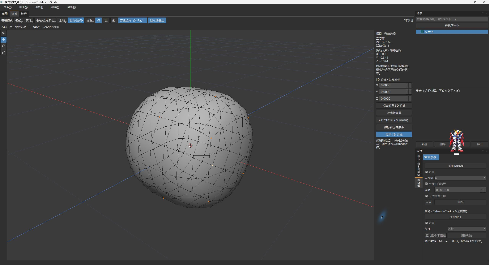

# 当前 Release 原生桌面视觉验收

## 业务结论

2026-10-03，代理已直接构建、启动并通过真实 Windows 桌面输入检查核心建模流程。
在下表实际覆盖的路径中未确认阻断性产品缺陷；没有要求用户参与点击或观察。
这是**本机核心路径通过、带未覆盖项的视觉验收**，不是 V2 整体验收或发布批准。

实际应用为性能收尾后的 Release，主程序 SHA256：
`0B55C152DC9F230D217F3B42658B30C315FF2DF52A59200ABB0375709DC7E69A`。
基线 HEAD 为 `6dd209f38122aca837ec04077d58b78da2f47726`，包含未提交二期改动。
[构建身份](build.json)、[构建日志](build-release.log)、[部署日志](deploy.log)和
[24 项源码/测试/探针哈希核对](source-hash-check.json)可复核来源。
本轮没有修改生产源码、重跑无变化的全量 CTest、重打包、提交、推送或发布。

## 方法与证据

使用 `@oai/sky` 操作真实应用，每次观察后执行一个点击、按键、拖动或滚轮动作，
立即刷新截图再决定下一步。没有使用 Qt Test、SceneViewModel API 或脚本直接制造 GUI 结果。
GUI 操作结束后才只读核对保存文件；这些核对不冒充额外的鼠标操作或完整 C++ 网格校验器。

记录共 209 步，其中 196 步为桌面输入/激活动作，258 张原始截图哈希全部核对。
正式保留 49 个代表步骤的 52 张原图及对应 accessibility 文本。
[机器可读报告](report.json)、[完整动作索引](actions.jsonl)和[正式文件清单](manifest.json)
记录步骤、UTC 时间、动作参数、工具输出的实际截图尺寸及 SHA256。
索引中未精选的 PNG/文本仍保存在 `E:/Mini3D/out/validation/visual-manual-20261003/`，
不能认为每个索引路径都已复制到本正式目录。

第一条观察为北京时间 12:42:46，正常关闭确认在 14:05:32。
这段跨度包含查证、分析和工具等待，不宣称连续 30 分钟真人耐久。
常见最大化截图为 2560×1392；截图尺寸不作为 Qt DPR 或 Windows 原生缩放证明。

## 实际覆盖结果

以下“通过”仅指所写动作和观察结果，不代表同一功能全部参数、所有异常边界或三档 DPI 重验。

| 检查项 | 真实动作与观察 | 代表证据 |
| --- | --- | --- |
| 工作台与选择 | 中文界面；对象点选后视口轮廓、树和属性同步；建模区没有时间轴占位；Tab 切编辑，点/边/面可切换 | [对象选择](captures/003-object-cube-pick-0.png)、[活动面](captures/007-top-face-select-0.png) |
| 内插与 F9 | 顶面 I 输入 0.2 确认，F9 改 0.3；仍为 10 面而非叠加第二圈；一次 Undo 回原 6 面，Redo 恢复 | [F9 结果](captures/018-f9-replace-result-0.png)、[单次撤销](captures/020-inset-single-undo-0.png) |
| 挤出及取消 | E 输入 1 预览增加至 14 面，Esc 恢复原形；F3 输入中文“挤出”后执行并确认 | [预览](captures/023-extrude-one-preview-0.png)、[取消](captures/024-extrude-cancel-restored-0.png)、[中文搜索](captures/027-f3-chinese-query-0.png) |
| 环切与历史 | Ctrl+R 预览，左键进入滑移，右键居中确认；Undo/Redo 恢复拓扑 | [居中结果](captures/038-loop-cut-center-confirm-0.png)、[撤销](captures/039-loop-cut-undo-0.png) |
| 文件闭环 | 通过真实文件对话框保存中文路径、从磁盘重开、由文件菜单导出求值 OBJ；最终源为 20 点/18 面 | [重开](captures/086-scene-reopened-from-disk-0.png)、[导出](captures/095-obj-export-succeeded-0.png) |
| 布局与穿透框选 | T/N 隐藏及恢复；工具栏 X-Ray 开启后 B 框选顶部 4/20 点 | [穿透框选](captures/059-xray-box-select-top-vertices-0.png) |
| 比例编辑 | O，G/Y/1 预览；可见半径圈，滚轮半径 1→0.578704；Esc 恢复形态、选区和保存状态 | [半径改变](captures/064-proportional-radius-wheel-0.png)、[取消](captures/065-proportional-cancel-0.png) |
| Local View | 小键盘 `/` 进出，球体/平面恢复，选中对象与视角保持 | [隔离](captures/067-local-view-enter-0.png)、[恢复](captures/068-local-view-exit-0.png) |
| 旋转后缩放与退出保护 | R/Z/45 后 S/X/2 成功，没有 TRS 拒绝；关闭出现未保存提示，取消保留；两次 Undo 回保存态 | [缩放确认](captures/078-rotation-world-x-scaling-confirm-0.png)、[关闭提示](captures/080-close-dialog-reobserve-0.png) |
| 视图及覆盖层 | 小键盘正/顶/侧视图、透视/正交切换和滚轮缩放；关闭覆盖层后轴线/选择辅助消失，恢复后显示 | [顶视](captures/203-viewport-top-view-0.png)、[侧视](captures/204-viewport-side-view-0.png)、[关闭覆盖层](captures/205-viewport-overlays-hidden-0.png) |
| 着色与快捷收藏 | Z 饼菜单切线框；F3 结果通过上下文菜单加入实体着色收藏；Q/Enter 执行后恢复实体 | [线框](captures/100-wireframe-pie-selected-0.png)、[加入收藏](captures/116-favorite-add-solid-click-0.png)、[Q 执行](captures/119-quick-favorites-execute-solid-0.png) |
| 游标与移动吸附 | 游标枢轴菜单可切换，表面放置得到非零世界坐标；步进 X 手柄 -1.5→-1.0；顶点模式 XY 手柄使对象到球顶点位置 (0,1,0)，Undo 恢复 | [表面游标](captures/104-cursor-placed-on-model-0.png)、[步进](captures/109-move-handle-step-snap-0.png)、[顶点对齐](captures/127-vertex-snap-sphere-top-commit-0.png) |
| 集合 | 新建中文“视觉验收集合”，移入对象，隐藏/显示可见；保存核对对象父节点和 TRS 未改变 | [隐藏](captures/136-collection-hide-0.png)、[恢复](captures/137-collection-show-0.png) |
| Mirror 夹持 | 从正视图框选 4 个中心源顶点；Clipping 开启时 G/X/1 后仍 X=0，关闭后同样输入到 X=1、两半分离；取消/Undo 恢复 | [夹持 X=0](captures/162-mirror-clipping-numeric-one-held-at-zero-0.png)、[不夹持 X=1](captures/168-mirror-no-clipping-numeric-one-0.png) |
| Mirror 应用 | Merge 开启应用得到 12 点，关闭应用得到 16 点；撤销各次应用和开关后恢复 8 点源笼与原 Mirror | [合并应用](captures/172-mirror-merge-enabled-apply-0.png)、[不合并应用](captures/176-mirror-merge-disabled-apply-0.png)、[恢复](captures/179-mirror-merge-toggle-undo-0.png) |
| 细分 | 二级改一级、关闭、Undo 均有对应形态；整链应用得到 162 点/160 面，Undo 恢复 8 点源笼与 Mirror→二级细分 | [一级](captures/192-subdivision-level-one-0.png)、[关闭](captures/193-subdivision-disabled-0.png)、[162 点](captures/198-subdivision-apply-chain-0.png)、[160 面](captures/199-subdivision-applied-face-count-0.png)、[撤销恢复](captures/201-subdivision-chain-undo-0.png) |

### 代表原图

## 保存作品与只读核对

仅写入本轮测试副本，不覆盖用户场景或正式样例。

| 副本 | 核对结果 |
| --- | --- |
| [内插挤出环切](artifacts/视觉验收_内插挤出环切.m3dscene) | 格式 3、Y-up；源 20 点/36 边/18 面，72 面角；边界边 0 |
| [视图与游标](artifacts/视觉验收_视图与游标.m3dscene) | 与建模副本几何/对象相同；保存非零游标及中文集合，集合含对象 2 且可见 |
| [镜像](artifacts/视觉验收_镜像.m3dscene) | 与正式 symmetric.m3dscene 逐字节哈希相同；源 8 点/5 面、4 条边界边；Merge/Clipping/enabled 均恢复 |
| [细分](artifacts/视觉验收_细分.m3dscene) | 与正式 subdivision.m3dscene 逐字节哈希相同；源 8 点/5 面、Mirror→enabled 二级细分 |
| [柱体 OBJ](artifacts/视觉验收_柱体.obj) | 20 v、18 f、72 vt、72 vn；索引合法，多边形连接及绕序与保存源相同；加对象平移后最大位置误差 0 |

四个保存文件的必填面角字段及有限向量由[独立字段检查](scene-shape-check.json)核对。
生成面角的 normal 可以省略；未声称这是完整 JSON Schema 引擎、全局自交或全部拓扑校验。
8 个正式样例文件和旧候选 ZIP 的 SHA256 保持不变；本轮没有再次进行 Blender 外部导入。

## 观察到的工具与环境边界

- Alt+Z 被 NVIDIA 覆盖层截获；已关闭本次触发的覆盖层，改用 Mini3D 工具栏测试 X-Ray。未更改系统快捷键或设置。
- 修改器复选框焦点下第一次 Ctrl+Z 未恢复；重新将焦点放回视口后恢复正确，未据此认定产品故障。部分快照/焦点滞后一帧时补独立观察。
- 工具曾拒绝旧索引点击及没有已观察焦点的文字输入；刷新观察后才继续，不把这些拒绝计入成功输入。
- 归档器两次失败均在正式目录创建前停止：一是误比对回归后已更新的文档哈希，二是误把可选法线当必填。依据真实数据与 schema 分段检查后通过；[第一次原始失败](collect-first-failure.txt)、[第二次原始失败](collect-second-failure.txt)保留，没有改生产程序来迎合检查器。

## 未覆盖项与风险

真实中文 IME 组合输入、Windows 原生 100/150/200% 与 mixed-DPI 跨屏、全新 Windows
机器、完整连续耐久、许可及正式发布仍未验证。中文 Unicode 注入不等于 IME。
当前拖动 API 只表达左键拖动，不能覆盖中键环绕或 Shift+中键平移；只测试了已写出的视图快捷键。
没有通过 GUI 删除数据；该动作要求现场确认，本轮没有为此打断用户。
Loop/Ring/连通选择、倒角、补面、Repeat 和全部异常输入没有分别进行本轮原生 GUI 复验，
既有自动回归不能改写为新的视觉通过。本轮也不是 S01–S12 的完整逐项重跑。
滚轮缩放曾产生 dirty，不能宣称所有视图操作均不改变保存状态。

如果据此直接宣布全部验收或发布，会把未覆盖的输入、显示环境、函数路径和旧包版本当成已通过。
下一步最小动作是按这些缺口定向补验；需要新的显示环境或输入能力时单独记录环境前提，
不要求用户代为完成本轮已覆盖的操作，也不凭截图或文案伪造外部验证。
未启动子代理；主会话 provider 内部模型映射无法独立核实。

## 环境恢复

最后一次显式保存细分副本后，仅正常关闭本轮应用窗口；后续窗口清单及进程检查均确认无 Mini3D 遗留。
未关闭用户窗口。恢复本轮备份的应用偏好后重新导出，SHA256 与测试前完全一致：
`66994D650EC2DD2CF81D4DDA2FCC485C6FA77CC7E11093E92E81DDBEA43DAC4E`。
[恢复结果](cleanup.json)仅包含核对元数据，不公开偏好内容；原始注册表备份留在本机 out/before。
