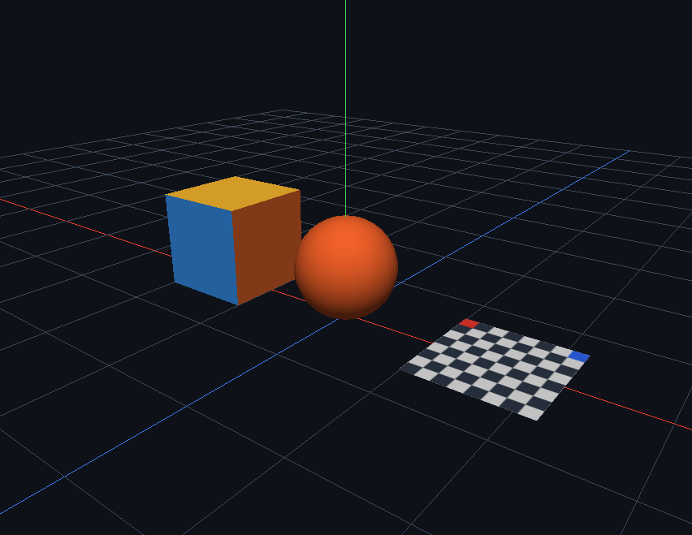

# 第二周实现与验收

方案附录 A 的第二周范围已完成：PrimitiveFactory、GpuTexture、Material、Aabb、Ray。
本轮保留 Day 8 的几何和相机能力，补齐纹理、基础材质及纯数学支撑，不包含第三周的场景编辑。



## 纹理与基础材质（2026-09-08 已验证）

- Cube 使用原有顶点面颜色；Sphere 使用独立橙色基础材质；Plane 使用棋盘格贴图。
- 棋盘格在程序初始化时生成，无需外部图片。图像左上角为红色、右上角为蓝色；
  显示时两标记应落在 Plane 的 -Z 边，红色位于 -X 端。
- UV 原点位于左下；GpuTexture 接收顶部首行的 QImage，转换 RGBA8 并垂直翻转一次。
  上传生成 mipmap，使用线性过滤与重复寻址；调用方不要预先翻转图像。
- Cube 每面独立 UV；Sphere 接缝处复制顶点，U 分别为 0 与 1，425 顶点、2160 索引；
  极点仍跳过退化三角形。Plane 的 U 沿 +X，V 沿 -Z。
- Material 支持 baseColor、可选顶点颜色、可选纹理的乘积。不透明、固定方向光；
  尚不包含 Gamma/sRGB、透明混合、PBR 或可视化材质编辑面板。
- Renderer 拥有纹理，Material 的纹理指针只借用资源；GPU 操作必须处于所属当前 Context。
  纯色物体绑定 1×1 白色纹理，避免 NVIDIA 对采样器绑定未定义纹理 0 的警告。

## 测试入口

完成 Build 后，在 PowerShell 7 中执行（替换为实际构建目录）：

```powershell
ctest --test-dir out/build/opengl-viewport-verify -C Debug --output-on-failure
ctest --test-dir out/build/opengl-viewport-verify -C Debug -L headless --output-on-failure
ctest --test-dir out/build/opengl-viewport-verify -C Debug -L gpu --output-on-failure
```

mini3d_tests 仍是纯 GLM/Catch2，无 Qt/OpenGL 依赖。mini3d_gpu_tests 为新增独立验收程序，
需要本机 OpenGL 4.1 驱动，用离屏 Surface/FBO 读回像素，不读取桌面屏幕。
CTest 为 GPU 测试自动补入当前配置 Qt DLL 目录；无法创建 Context 时测试失败，不自动跳过。
GPU 测试覆盖图像翻转、RGB888 转 RGBA、mipmap、贴图/纯色/顶点色切换、
空图像拒绝、重复释放和重新上传。

## AABB 与 Ray

- `mini3d_core` 为纯 C++/GLM 静态库，不依赖 Qt 或 OpenGL。
- `MeshData::bounds()` 从当前全部顶点计算局部包围盒，不缓存；空网格返回无效盒。
- `Aabb` 默认空盒，`expand()` 输入有限点；角点有限且各轴 minimum ≤ maximum 时有效。
  零厚度平面盒有效。`transformed()` 接收仿射矩阵，变换八个角点后重新包围，支持
  平移、旋转、负缩放及非均匀缩放；不用于透视投影矩阵。
- `intersectRayAabb()` 的射线和盒必须在同一坐标空间，返回最近非负参数 t，满足
  `origin + t * direction`；仅在方向已归一化时 t 才是距离。盒内或边界出发返回 0。
  未命中、无效盒、非有限射线、零方向返回 false，且不修改输出参数。
- 数学测试覆盖各轴正负方向、平行/近似平行、背向、角点擦边、内部起点、薄平面、
  仿射变换及无效输入。此处是拾取的基础算法，还没有屏幕射线或对象选择功能。

## 验收结果（2026-09-08）

- MSVC Debug、Release 构建通过；两种配置的 CTest 均为 2/2 通过。
- CPU：14 个用例、9360 条断言；GPU：1 个用例、30 条断言，固定种子 42。
- 编辑器实际帧缓冲验证了 Cube 顶点色、Sphere 橙色和 Plane 棋盘格；
  纹理 0 警告修正后的日志无 GL 错误、上传失败或释放失败。
- 证据保存在 `out/validation/week2-materials-verified.png` 和同名前缀的 cdb 日志；
  正式截图见本页顶部。构建目录为 `out/build/opengl-viewport-verify`。
- Release 运行证据为 `out/validation/week2-release-final*`，852×659、78 种采样颜色，
  正常退出，PNG 与 Debug 版本 SHA-256 一致：
  `852E7D903D3D0481EA04ABD8D9FD47566494DDEDA9165690F9FDE85F34677D4F`。

## 范围与下一阶段

Scene/Inspector Dock 仍是壳层，物体与材质仍由 Renderer 固定装配。未实现 glTF 导入、
场景树编辑、鼠标拾取、Gizmo、Undo 或保存加载。第三周先实现 EntityId、Transform、Scene
的父子关系及世界矩阵测试，再对接场景树和 Inspector；须由用户明确启动下一阶段。
