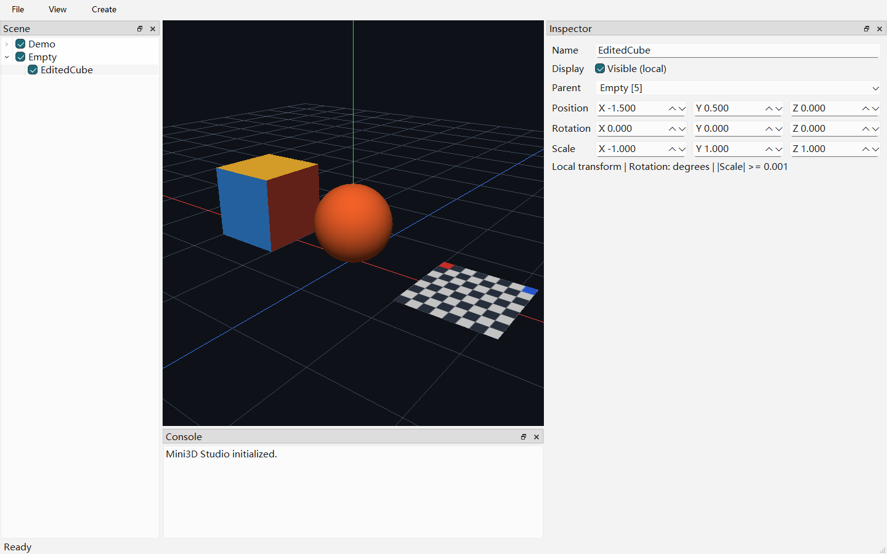

# 第三周场景编辑

## 场景模型

- EntityId 在当前 Scene 内单调增长，0 表示根层/无选择；删除后不复用。
- Scene 只公开只读节点，变更必须通过接口维护父子关系。根节点按 ID 排序。
- 换父保留 Local Transform，不保持 World Transform；拒绝自身、祖先循环和不存在的父节点。
- 删除策略为级联子树；界面删除/复制与 Undo 仍留在后续周。
- Transform 内部使用四元数，Local = T × R × S，World = ParentWorld × Local。
  有限值、可归一化四元数和各轴绝对值至少 0.001 的缩放才允许写入。
  负缩放有效；拒绝零缩放是为了避免当前 Shader 法线矩阵不可逆。
- 子节点的实际可见性同时受全部祖先控制。
- PrimitiveKind 仅表示当前内置 Empty/Cube/Sphere/Plane，不提前创建导入资源系统。

## 操作方式

1. 启动后展开 Demo，选中 Cube/Sphere/Plane，右侧显示当前对象属性。
2. 编辑 Position、Rotation、Scale 数值，按 Enter 或离开输入框提交；视口立即更新。
   修改 Demo 的位置/旋转/缩放可验证整组子节点跟随。
3. 双击树名称或编辑 Inspector 的 Name 后按 Enter 可重命名；勾选框控制自身可见性。
   父节点隐藏时，其勾选状态仍为可见的子节点也不会绘制。
4. Create → Empty/Cube/Sphere/Plane 在根层创建对象并选中；新对象局部变换为单位变换。
5. Inspector 的 Parent 下拉框选择父节点；自身及后代不列入候选，<Scene root> 表示根层。
   换父保留局部变换，世界位置可能变化。当前树结构重置会折叠未选中的分支，可重新展开。

旋转 UI 单位为度，显示由四元数恢复的等价欧拉角，不保证保留输入的圈数/欧拉角表示。
数值输入范围为 ±10000，精度为三位小数；各缩放轴绝对值至少 0.001。拒绝输入时恢复
原数据并显示原因。修改只存在内存中，关闭软件不会保存；当前没有 Undo。



## 模块与生命周期

- SceneViewModel 是编辑意图入口，负责业务写入和通知；SelectionModel 只保存稳定 ID。
- SceneTreeModel 用 QAbstractItemModel 映射 Scene；QModelIndex 内保存 ID，不复制节点。
  属性变化发送 dataChanged；创建/换父使用成对的 beginResetModel/endResetModel。
- MainWindow 负责装配和连接；TransformInspector 只读取状态及转发编辑意图，使用
  QSignalBlocker 防止刷新产生重复写入。结构重置期间忽略临时无效树选择，随后按 ID 恢复。
- ViewModel 与 Viewport 共享 Scene 生命周期，Viewport 持有 shared_ptr<const Scene>，
  Renderer 在绘制调用中只读遍历。场景变化只请求重绘，不在 UI 事件中操作 OpenGL。
- Renderer 复用三种内置 GPU Mesh，按父子矩阵递归绘制；镜像变换根据世界矩阵行列式
  调整正面绕序。Empty 不绘制实体表面，隐藏祖先直接跳过其子树。
- mini3d_editor_ui 静态库供应用与测试共用，AUTOMOC 仅用于新 QObject 模型。

## 验收（2026-09-08）

- MSVC Debug、Release 构建通过；两种配置的 CTest 均为 3/3 通过。
- CPU：19 用例/9413 断言；独立 GPU：1 用例/30 断言；编辑器：3 用例/64 断言。
  启用编辑器截图时额外验证保存成功，共 65 条编辑器断言。
- Qt QAbstractItemModelTester 验证模型契约；测试覆盖选择同步、中文重命名、换父通知、
  数值编辑、数据反向刷新无循环、零缩放拒绝及可见错误提示。
- 真实窗口测试使用鼠标选树、键盘改名、菜单创建和父节点控件换父；读回帧缓冲确认
  父节点移动、隐藏会改变画面，恢复后画面回到初始值；镜像缩放仍绘制几何。
- 正式编辑器截图来自 QWidget::grab（含内部 OpenGL Viewport），不是桌面屏幕复制。
  原始证据位于 out/validation/week3-editor-debug.png。
- 独立应用启动/正常退出证据：out/validation/week3-final-viewport.png 与 week3-final-cdb.log。
  GPU 测试频繁同步读回可能产生 NVIDIA Pixel-path performance warning；未发现 GL
  无效调用、纹理未定义或资源释放错误。

```powershell
ctest --test-dir out/build/opengl-viewport-verify -C Debug --output-on-failure
ctest --test-dir out/build/opengl-viewport-verify -C Release --output-on-failure
ctest --test-dir out/build/opengl-viewport-verify -C Debug -L headless --output-on-failure
ctest --test-dir out/build/opengl-viewport-verify -C Debug -L ui --output-on-failure
```

构建 UI 测试需要 Qt Test 模块；GPU/UI 测试需要 Windows 图形环境与 OpenGL 4.1 驱动，
无法创建窗口或 Context 时报告失败，不自动跳过。

## 未实施范围

拖拽换父、对象删除/复制界面、视口点击拾取与高亮、Gizmo、Undo、glTF、资源系统、
保存加载均未在本轮实施。第四周从 AssetId/CPU 资源和固定 GLB 样例导入开始，等待用户指示。
