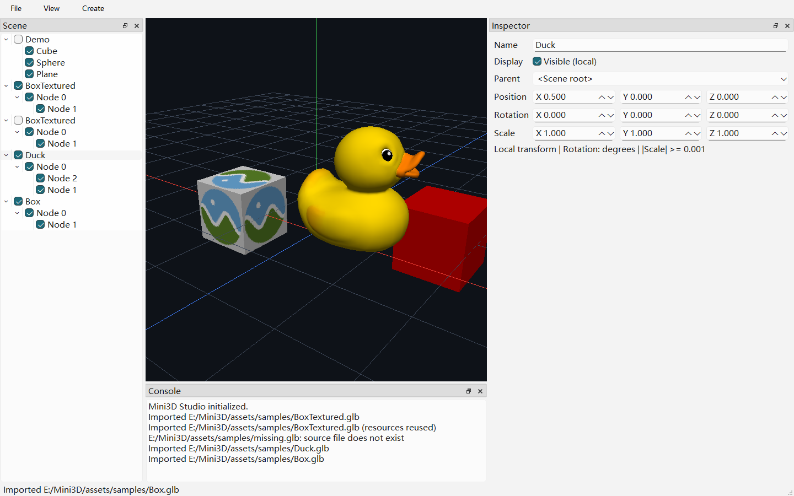

# 第四周静态 glTF 导入

## 完成结果与操作

已完成静态模型从文件到可编辑场景和真实 GPU 绘制的闭环，未进入第五周。

1. 运行编辑器，取消 Scene 树中 Demo 的勾选，便于观察导入结果。
2. 选择 File → Import glTF / GLB...（Ctrl+I），打开 `assets/samples/BoxTextured.glb`。
3. 树中自动选中以文件名命名的导入根节点；展开可查看源文件层级。
4. 在 Inspector 编辑根节点或子节点的局部 TRS、名称、Parent 和可见性。
5. 再导入 Duck.glb 或 Box.glb；重复导入同一路径会创建独立实例并复用资源。

Console 保留成功、警告和失败详情，状态栏显示最近操作结果。取消文件选择无副作用；
解析失败不改变现有场景或选择。暂无自动聚焦，相机仍使用中键 Orbit、Shift+中键 Pan、
滚轮 Zoom；模型不在视野内时需要手动调整相机或 Inspector。



截图显示左侧贴图方块、中间 Duck 和右侧红色 Box；示例调整了导入根的位置，
不是导入后自动排布。Console 中的 missing.glb 是自动测试刻意触发的失败记录。

## CPU 数据契约

- Assets 单向依赖 Core 和 Qt Gui（QImage 解码），不依赖 Renderer/OpenGL。
- MeshData 定义迁入 Core，旧 Renderer 路径保留别名，不改变顶点布局。
- GltfImporter 只生成暂存 CPU 资源，失败返回带路径、阶段和对象索引的错误。
- AssetManager 在完整解码验证成功后分配稳定 AssetId。同一规范化路径复用首次成功资源；
  修改源文件后需重启再导入，当前不做热重载。每次实例化仍可创建独立场景节点。
- 支持默认 Scene（无默认值时选首个）的 Node 层级、TRS 和可表示为 TRS 的矩阵；
  不支持剪切/透视矩阵，沿用 |scale| ≥ 0.001 的场景约束。
- 支持三角形 POSITION/NORMAL/TEXCOORD_0、8/16/32 位索引、非索引几何、交错字节步长；
  缺失法线时按面积加权生成。当前显式拒绝 sparse accessor、骨骼、动画、Morph、Draco/Meshopt。
- 支持基础颜色、PNG/JPEG 外部/内嵌纹理和采样器；不实现完整 PBR、透明混合和 Gamma。
  图片解码失败降级为基础颜色并警告；外部文件加载或几何结构错误导致整次导入失败。
- glTF UV 的顶部原点转换为内部底部原点（V = 1 − V）；QImage 保持顶部首行，
  GPU 上传继续统一翻转一次。保留第二周内置几何的 UV 契约。

## 场景与 GPU 契约

- File 菜单只传递路径；SceneViewModel 调用 Assets，在成功后一次性实例化场景层级。
- 多 primitive 的 Mesh 拆成子节点，保留原 Node 的局部变换；共享 Mesh 的节点复用 AssetId。
- Scene 仅保存网格/材质 ID；Viewport 持有共享只读资源库，Renderer 在有效 Context
  内按 AssetId 懒上传并缓存 GPU 网格和纹理，继续复用内置几何与材质绘制路径。
- 采样器的过滤和环绕方式、材质双面标记生效；负缩放沿用第三周正面绕序修正。
- Context 清理时释放导入缓存；GPU 上传失败记录一次并跳过网格或降级为基础颜色，
  不在每帧重复上传。CPU 导入成功并不承诺超出显卡容量的资源能上传成功。

## 限制

- 仅静态三角形，不是完整 glTF 查看器；动画、骨骼、Morph、sparse accessor、压缩网格
  和不可表示的矩阵会拒绝。只实例化默认 Scene，不提供多 Scene 切换。
- 只使用基础颜色与 TEXCOORD_0 贴图；不使用顶点色、法线贴图、金属度/粗糙度等完整 PBR。
  Alpha Mask/Blend 按不透明绘制并警告，尚无 Gamma/sRGB 校正；外观不等同于 Blender。
- 可选扩展提示忽略，不支持的必需扩展失败；没有扩展专用的渲染实现。
- 同步导入，大文件读取和解码可能阻塞界面；没有后台任务、取消进度或性能规模承诺。
- 资源缓存按规范化路径保留到编辑器关闭，没有热重载/卸载；修改源文件后需重启。
- 没有视口鼠标拾取、对象拖动、撤销重做或保存加载；关闭应用会丢失本轮场景编辑。

## 最终验证

本机 MSVC 2022、Qt 6.8.3、OpenGL 4.1 Core，Debug/Release 全量构建和各自 CTest 4/4 通过。

| 测试入口 | 用例 / 断言 | 验证内容 |
| --- | --- | --- |
| mini3d_unit_tests | 19 / 9413 | 既有纯 CPU 几何、相机、场景与数学回归 |
| mini3d_asset_tests | 7 / 148 | GLB、外部 glTF、PNG/JPEG、层级、TRS/Matrix、缓存与非法输入 |
| mini3d_gpu_tests | 1 / 36 | 纹理方向、采样器 GL 状态、材质和生命周期 |
| mini3d_editor_tests | 4 / 99 | 真实 File 菜单、树/Inspector/帧缓冲、实例复用与失败恢复 |

普通执行共 31 个用例、9696 条断言。设置 `MINI3D_TEST_IMPORT_CAPTURE` 时 UI 多一条
截图保存断言；该环境变量是测试专用，不影响普通编辑器。

Assets 额外覆盖 U8/U16/U32 索引、无索引、归一化 UV、交错步长、缺失法线、Unicode 路径、
越界引用、错误层级、损坏 GLB、缺失外部文件、必需压缩扩展及图片解码降级。
UI 自动化以 Qt 非原生文件框模拟键盘输入和 Open 点击；正式应用仍用原生文件框，
因此自动化覆盖菜单接线与导入链路，不声称验证 Windows 原生文件框内部行为。

本轮验证使用 `out/build/opengl-viewport-verify`：

```powershell
cmake --build out/build/opengl-viewport-verify --config Debug --parallel 4
ctest --test-dir out/build/opengl-viewport-verify -C Debug --output-on-failure
cmake --build out/build/opengl-viewport-verify --config Release --parallel 4
ctest --test-dir out/build/opengl-viewport-verify -C Release --output-on-failure
```

UI 日志包含同步读取帧缓冲造成的驱动性能提示，不是 GL 非法操作；定向检查无
GL_INVALID、GL_OUT_OF_MEMORY、纹理不完整或资源上传/删除失败。
固定样例、哈希和许可见 [样例说明](sample-assets.md)。
