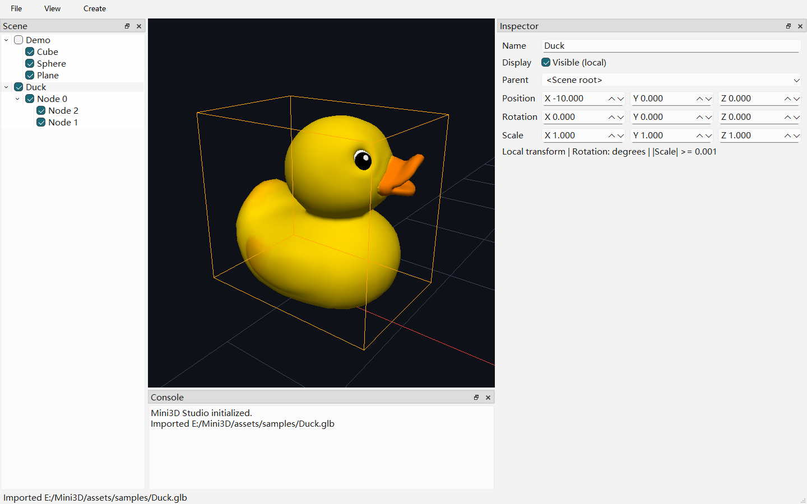

# 第五周选择、高亮与聚焦

## 完成结果与操作

第五周已完成，未进入第六周。可以直接用本机 Debug/Release 编辑器操作：

1. 左键点击 Cube/Sphere/Plane，树与 Inspector 同步选中，视口显示橙色包围盒。
2. 点击未命中任何对象包围盒的位置，取消选择；中键 Orbit、Shift+中键 Pan 和滚轮仍用于导航。
3. Ctrl+I 导入 Duck.glb；导入默认选中根容器，树中选中该根可高亮整个可见模型。
4. 让视口或场景树获得焦点后按 F，或选择 View → Focus Selection，聚焦所选可见几何。
5. 点击模型通常选择实际承载几何的子节点；要移动整组，在树中选择其父节点并编辑 Inspector。



截图中 Duck 的根节点已移到 X = -10，再用 F 聚焦；网格位于边缘是因为模型离开了
初始网格中心，不能据此判断导入坐标错误。示例素材署名与许可见 [样例说明](sample-assets.md)。

## CPU 契约

- EditorCamera 使用视口左上原点坐标生成单位世界射线，起点位于近裁剪面。
  输入坐标与相机尺寸必须使用同一单位；Qt 视口统一使用逻辑像素。
- RayCaster 将世界射线逆变换到每个几何的局部空间，与局部 AABB 相交。
  不归一化变换后的方向，保证非均匀/负缩放下的距离排序；等距按稳定树顺序处理。
- 只拾取可见几何节点，隐藏祖先遮断整棵子树；空容器不抢占点击。
- 世界包围盒包含所选节点自身及可见后代，供高亮和 Focus 共用；无几何或隐藏时为空盒。
- Focus 保持 yaw/pitch，按包围球和横/纵较窄视角留出 10% 裕量；空盒不改变相机。
  延续最小观察距离 0.6，默认最大 50；聚焦大模型时扩展最大距离和远裁剪面。
- 本周为 AABB 近似选择，非 Ray/Triangle 或像素级选择，后两者不在本周范围。

## 交互与 GPU 契约

- 选择只由 SelectionModel 持有。点击射线经 ViewModel 转换为 ID，树/Inspector/高亮同时订阅，
  不在三个界面中维护独立选择状态。点击空白清空选择；无修饰左键短点击才发起拾取。
- 按下/释放之间位移超过系统拖动阈值时不拾取；Ctrl 等修饰点击暂不做多选。
  中键导航不选物体，不修改 Transform；对象拖动仍属于第六周。
- F 的快捷键作用域仅为视口和树控件本身，不抢占属性输入或树内重命名编辑器的字符。
  View 菜单始终可调用聚焦；隐藏对象、无选择或无可见几何的容器保持相机不变并提示。
- SelectionRenderer 用固定单位盒十二条边变换得到世界包围盒，显示为橙色 1 像素线。
  不做轮廓描边，不逐帧创建 VAO/VBO；覆盖层可透过模型观察，不写深度，绘制后恢复深度状态。
- 聚焦使用同一可见子树包围计算，不直接按文件名或初始模型尺寸估计。

## 限制

- AABB 是近似包围，不是模型表面：点击球体/凹模型旁边但仍在盒内的位置也可能选中，
  包围盒重叠时按最近盒命中处理。暂不做三角形、背面、透明像素或 GPU ID 精确选择。
- 射线从近裁剪面向前检测，不进行远裁剪面/渲染成功状态过滤；资源超出视距时优先在树中
  选中并 F 聚焦。选择高亮是可透视的世界轴对齐盒，不随物体旋转成定向盒。
- 只支持单选；没有 Gizmo、框选、吸附、撤销重做或保存。关闭仍丢失场景编辑。
- 沿用最小距离 0.6 与近裁剪面 0.1，极小模型不会无限放大；大模型聚焦可扩展距离，
  但不承诺任意尺度/坐标的浮点精度。缩窄窗口后可再次按 F 重新 Fit，不强制锁定相机。
- 拾取遍历场景；导入网格包围查询读取 CPU 顶点，没有空间加速结构或大规模场景性能承诺。

## 最终验证

Windows x64 / MSVC 2022 / Qt 6.8.3，Debug 和 Release 全量构建及 CTest 各 4/4 通过。

| 入口 | 用例 / 断言 | 覆盖 |
| --- | --- | --- |
| mini3d_unit_tests | 21 / 9654 | 既有数学、场景、相机；屏幕射线与横竖视口 Fit |
| mini3d_asset_tests | 11 / 187 | 静态导入回归；最近命中、变换、隐藏和导入实例 |
| mini3d_gpu_tests | 2 / 53 | 纹理/材质回归；线框像素、深度状态与释放/重建 |
| mini3d_editor_tests | 6 / 157 | 既有编辑/导入；真实鼠标选择、树联动、空白取消、F、文本输入与旋转后 Resize |

普通执行共 40 个用例、10051 条断言。设置 `MINI3D_TEST_SELECTION_CAPTURE` 时额外
执行一条整窗截图保存断言（UI 共 158 条），该环境变量仅用于测试程序。
`QT_SCALE_FACTOR=2` 下完整 UI 入口通过，并额外断言实际 devicePixelRatioF 为 2，
验证高 DPI 下鼠标和射线使用一致尺度。最终 Debug 四个入口均连续通过三轮。

```powershell
cmake --build out/build/opengl-viewport-verify --config Debug --parallel 4
ctest --test-dir out/build/opengl-viewport-verify -C Debug --output-on-failure
cmake --build out/build/opengl-viewport-verify --config Release --parallel 4
ctest --test-dir out/build/opengl-viewport-verify -C Release --output-on-failure
```

本轮 GPU/UI 验收使用真实 OpenGL Context、离屏 FBO 与 QOpenGLWidget 帧缓冲。
Qt Test 验证控件内事件与快捷键，不声称替代所有驱动和多显示器实机测试。
Debug UI 日志中的同步 Pixel-path 性能提示来自帧缓冲读取，不是 GL 正确性错误。
