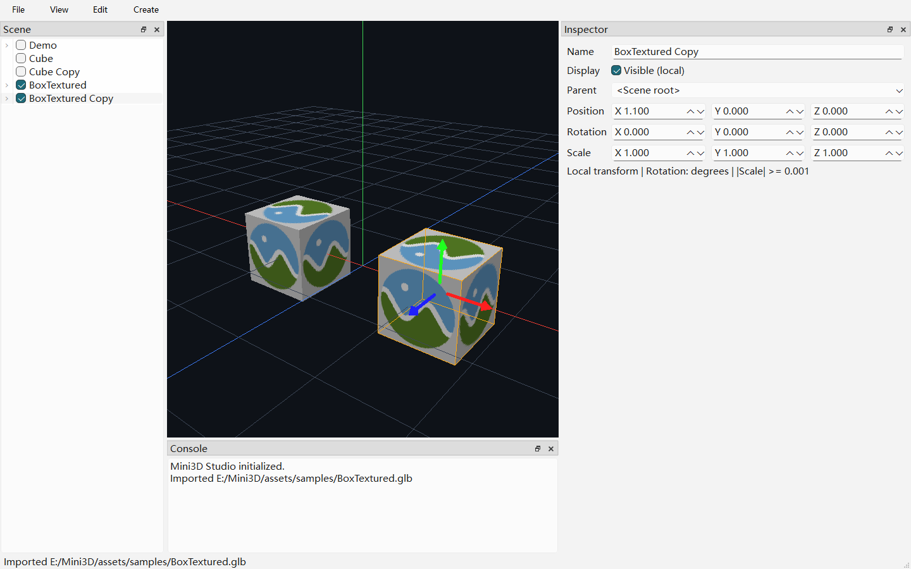

# 第六周移动、撤销与对象管理

状态：2026-09-09 五个阶段已完成；第七周尚未开始。

## 阶段 1：变换历史

SceneViewModel 拥有 QUndoStack；TransformEntityCommand 按 EntityId 保存完整前后 TRS。
Inspector 提交的每次有效变更形成一条记录，无变化或无效变换不入栈。
创建、导入、重命名、显隐、换父尚未实现撤销，其成功操作清空本周历史；选择/相机操作不清空。
本周不实现保存加载，不承诺历史跨应用重启保留。

## 阶段 2：世界空间移动手柄

在场景树或视口按 W 开关移动工具（也可通过 View 菜单），默认关闭。
选中可见对象后，在对象原点显示红 X、绿 Y、蓝 Z 轴；悬停轴显示黄色。
手柄长度保持约 90 个逻辑像素，不受物体缩放影响；空容器也可显示手柄。
与视线近乎平行的轴不响应拾取，避免拖动计算不稳定。手柄作为覆盖层绘制。

## 阶段 3：拖动事务

左键优先命中手柄，沿对应世界轴拖动；未命中则保留第五周点击选择规则。
拖动过程实时更新 Inspector，松开提交一条 Transform 命令；Esc 恢复拖动前状态。
失焦、窗口隐藏/失活、丢失鼠标捕获、视口尺寸变化、切换选择/工具、其他编辑会取消预览。
拖动时冻结相机，不响应中键和滚轮。带父旋转和负非均匀缩放时仍沿世界轴移动。
Ctrl+Z 撤销，Ctrl+Y / Ctrl+Shift+Z 重做；快捷键仅在树/视口焦点生效，不抢文本编辑。
也可通过 Edit 菜单调用。取消或无变化的手势保留已有 redo 分支。

## 阶段 4：复制和删除

在树或视口按 Ctrl+D 复制选中子树，Delete 删除选中子树；Edit 菜单提供相同操作。
副本名称附加 ` Copy`，位于相同父节点及位置，可立即用手柄移开。每个节点拥有新 EntityId，
但网格、纹理和材质继续共享 AssetId，不重新导入或上传。修改副本变换不影响原件。
撤销删除恢复原 ID、子树关系、兄弟顺序、名称、TRS、显隐和资源引用；复制重做保持首次生成 ID。
撤销复制重新选中原件，撤销删除重新选中被删子树；无选择时两个动作禁用。
快照仅用于本次编辑器会话，节点数据封装为只读内存快照，不是场景文件格式。
删除不卸载资源；共享缓存和历史随编辑器生命周期保留。

## 阶段 5：整合验收

环境：Windows、MSVC 14.40、Qt 6.8.3、OpenGL 4.1 Core，NVIDIA RTX 3050 Laptop。
Debug 和 Release 均完整构建成功，CTest 各 4/4；Debug UI 连续三次通过。
固定随机种子 42 的 Debug 结果：

| 入口 | 用例 | 断言 | 覆盖 |
| --- | ---: | ---: | --- |
| Core / 数学 | 24 | 9722 | 子树快照、三轴拾取、像素尺度、父变换下世界拖动 |
| Assets / 拾取 | 11 | 187 | 导入与第五周选择回归 |
| GPU | 2 | 56 | 纹理、线框、三轴覆盖层与状态恢复 |
| Editor | 11 | 240 | 命令混合回放、真实拖动/取消、快捷键与文本编辑隔离 |

`QT_SCALE_FACTOR=2` 下 Editor 11 用例/242 断言通过，包含真实 devicePixelRatio 检查。
纯 CPU 可执行文件的 dumpbin 依赖仅含 Windows/MSVC 运行库，不含 Qt/OpenGL。
GPU/UI 日志未发现 GL_INVALID、GL_OUT_OF_MEMORY、资源上传/删除或初始化错误；
截图读取产生的 Pixel-path 同步性能提示不属于渲染失败。

### 最小手工验收

1. 创建 Cube，选中后在视口按 W，分别拖动红 X、绿 Y、蓝 Z，确认 Inspector 位置同步。
2. 松开后 Ctrl+Z/Ctrl+Y 检查往返；再次拖动按 Esc，确认恢复且不增加历史。
3. Ctrl+D 复制后拖开，Delete 删除，连续撤销恢复副本和原件。
4. 给父节点设置旋转及非均匀/负缩放，选择子节点并拖轴，确认仍沿世界方向。
5. 在名称输入框使用 Delete/Ctrl+Z，确认只编辑文字；回到视口后快捷键管理对象。

上述手工步骤供交付后复验；本轮自动测试已覆盖对应数学、命令和核心真实窗口交互。

### 可执行验证

```powershell
cmake --build --preset debug-local
ctest --preset test-debug-local
cmake --build --preset release-local
ctest --preset test-debug-local -C Release
```

示例本机 Preset 仅定义 test-debug-local，Release 通过 `-C Release` 覆盖配置。
本机本轮实际构建目录是 `out/build/opengl-viewport-verify`：

```powershell
cmake --build out/build/opengl-viewport-verify --config Debug --parallel 6
ctest --test-dir out/build/opengl-viewport-verify -C Debug --output-on-failure
```

本机被忽略的 `out/validation/Test-Week6.ps1` 顺序执行双配置、重复 UI、200% 缩放及截图；
`Validate-Week6.ps1` 检查定向差异、格式/编码、文档链接、日志与 progress 仅追加。
测试专用截图变量 `MINI3D_TEST_GIZMO_CAPTURE` 仅由 GizmoEditorTests 读取，不影响普通应用启动。



截图来自真实 MainWindow 的 `grab()`，不是设计稿；显示 BoxTextured 副本、选中框和移动三轴。

## 本周边界

- 仅世界空间单轴平移；不含旋转/缩放 Gizmo、平面自由拖动、吸附或多选。
- 手柄在对象原点，不是包围盒中心；透视缩短会使朝向视线的轴显得更短。
- 未加入撤销的创建/导入/重命名/显隐/换父会清空历史；V1 完整撤销目标仍未全部实现。
- 历史与导入资源驻留内存；没有历史持久化、资源卸载、保存加载或大场景性能保证。
- 无新增依赖、网络、线程或外部文件格式；保留第五周 AABB 近似选择限制。
- C++ 保持 UTF-8 无 BOM/LF，使用既有 Qt 命名与 ViewModel 意图边界，没有全量转码。

## 回滚点

正式文件周前快照为 `out/validation/week6-before-20260909`（93 个文件）。按 progress.md
五阶段清单逐文件从快照恢复既有文件，移出本周新增源码、Shader、文档/截图，再重新构建。
不要运行 git clean/reset；仓库尚无 Git 提交基线，保留 `.user`、本机 Preset 与构建产物。
