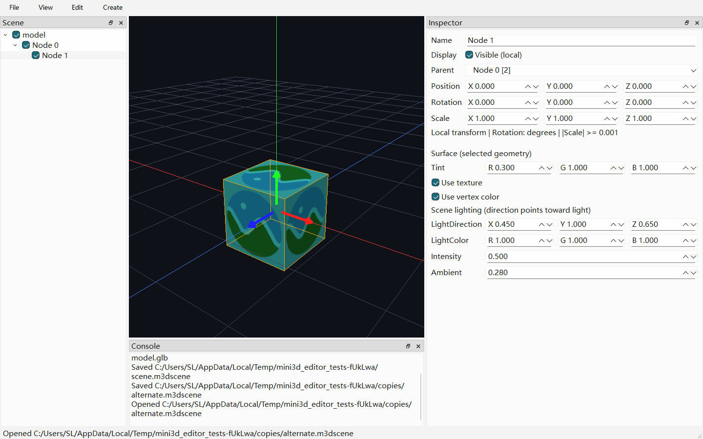

# 第七周：光照、材质与场景文档

## 光照与材质

Inspector 下方提供当前几何实例的 Tint RGB 乘色、纹理/顶点色开关。
空容器的外观项禁用，请展开导入子树选择实际几何。乘色不改动共享导入材质。
Scene lighting 为全局单方向光：方向指向光源，颜色 RGB、强度 [0,10]、环境项 [0,1]。
这些编辑可撤销；默认参数保持第六周画面。法线使用逆转置矩阵，双面材质背面翻转法线。
当前不是可拖拽的 Light 实体，不实现阴影、PBR 或完整 Gamma 流程。

## 实施状态

2026-09-09 完成三个阶段：光照/实例材质、场景文件与历史、文档 UI 与整合验收。
未自动进入第八周；本周完成不等于 V1 已发布。Light/Camera 场景实体尚未实现。

## 操作与验收

| 操作 | 入口 | 结果 |
| --- | --- | --- |
| 新建空场景 | File → New Scene / Ctrl+N | 清空节点、资源库和历史，重置观察相机 |
| 打开场景 | File → Open Scene / Ctrl+O | 加载 `.m3dscene` 并重建资源，清空旧历史 |
| 保存 | File → Save Scene / Ctrl+S | 首次选择路径，此后原位保存，保留撤销历史 |
| 另存为 | File → Save Scene As / Ctrl+Shift+S | 绑定新路径，重新计算资源相对路径 |
| 修改外观 | Inspector → Surface | 选择实际几何，调整 Tint 与两个颜色来源开关 |
| 修改光照 | Inspector → Scene lighting | 调整方向、RGB、Intensity、Ambient |

标题带 `*` 表示未保存。新建、打开、关闭前提供 Save / Discard / Cancel；
取消文件选择或保存失败均阻止丢弃当前编辑。保存前先取消尚未提交的手柄拖动，
并提交属性输入框内容。错误保留在 Console，同时显示状态栏提示。
应用启动仍为 Demo，不自动打开上次文档；没有自动保存或崩溃恢复。

最小人工验收：新建 → 导入 BoxTextured → 展开并选择几何 → 修改乘色/光照 →
中键/滚轮改变视角 → 保存 → 新建 → 打开刚保存的文件；模型、外观和视角应恢复。
再修改位置并关闭，选择 Cancel 应保留窗口与编辑；选择 Save 应保存后关闭。
新建/打开后选中状态不持久化，需重新选择对象才显示包围盒/手柄。



## 文件与历史契约

`.m3dscene` 是 UTF-8 JSON，`format=Mini3DScene`、`version=1`。保存节点 ID、名称、父关系、
显隐、局部 TRS（四元数 w/x/y/z）、内置类型、实例样式、光照和观察相机。
实体数组按父先子后、原兄弟顺序排列。资源表按文件内网格 ID 映射 glTF 相对路径及
`meshIndex`（导入器的 primitive 序号）。打开时重新导入并重映射 CPU AssetId，不保存 GPU 句柄。
未知字段忽略；必需字段缺失、未知版本、循环/重复 ID、非法变换、缺失资源均拒绝载入。
没有已发布旧格式，本周仅实现 version 1，不虚构版本迁移。

资源路径相对场景文件目录，可包含 `..`；移动项目时须保持场景与资源相对位置，
GLTF 外部 Buffer/图片也需同行移动。不复制或打包资源；跨盘无法形成相对路径时保存报错。
源模型应保持不变；修改源文件的 primitive 顺序可能改变引用结果，不提供热重载。
QSaveFile 原子写入且禁用直接覆盖回退；读取和资源解析在临时数据完成后才替换当前文档。

创建/导入、复制/删除、重命名、显隐、换父、TRS、实例材质和场景光照均可撤销。
保存绑定 QUndoStack clean index；打开/新建清空旧文档历史，保存不清空历史。
相机导航可保存，但不进入对象撤销链，其与保存时视角的差异单独计入未保存状态。

## 验证结果

本机 Qt 6.8.3 / MSVC x64、NVIDIA RTX 3050 Laptop、OpenGL 4.1，独立验证目录为
`out/build/opengl-viewport-verify`。Debug/Release 完整构建和各自 CTest 4/4 通过。
Qt Creator 使用的其他构建目录不会因此自动更新，使用前仍需在对应 Kit 重新 Build。

| 测试组（Debug，seed 42） | 用例 | 断言 | 重点 |
| --- | ---: | ---: | --- |
| 纯 CPU | 28 | 9929 | 场景 JSON、非法结构、相机恢复及缩放极限 |
| Assets/拾取 | 11 | 187 | 既有静态导入、共享缓存及 CPU 拾取 |
| GPU | 2 | 58 | 方向光、环境项和既有材质/手柄验证 |
| 编辑器 | 17 | 343 | 历史保存点、资源迁移、真实文件/关闭对话框 |

Debug 全部 UI 连续三次通过；`QT_SCALE_FACTOR=2` 下 17 用例/346 断言通过，
包括 devicePixelRatio 和 Inspector 无横向截断检查。截图模式文档 UI 3 用例/46 断言通过。
CPU 测试经 `dumpbin /dependents` 确认无 Qt/OpenGL DLL 依赖。
本轮 33 个改动 C++ 文件通过 clang-format，44 个文本文件为 UTF-8 无 BOM/LF；
文档链接、diff 空白、progress 仅追加及 GPU 错误日志扫描通过。

关键失败定位与修复：

- QUndoStack 析构曾通知已进入析构的主窗口，触发 Qt 类型断言；现在 ViewModel 析构先断开通知。
- 文件对话框测试的完整路径逐字输入触发目录补全；改为先定位目录、输入文件名并点击按钮，
  加入超时保护。正式对话框行为未替换为模拟保存。
- 保存前后最初有 10/561468 个像素不同。隔离证明是相机位置与球坐标转换的浮点舍入影响边缘；
  使用相同相机重建条件后，文件往返画面仍要求逐像素相等，未使用宽泛图像容差。
  另用 CPU 测试检查恢复位置/矩阵误差、远大模型投影和导航边界。
- 极限缩放时重算距离略大于上限，曾被文档状态验证拒绝；使用百万分之一相对长度容差，
  正常极限状态与恢复再次有效，真正越界状态仍拒绝。
- 新滚动容器初始宽度曾截断 Inspector 三轴输入；按内容最小宽度约束容器，并加入布局断言。

同步读回截图会输出 `Pixel-path performance warning`，属于预期性能提示；
本轮未发现 GL_INVALID、GL_OUT_OF_MEMORY、资源上传/删除或初始化错误。
测试只写临时项目；未对用户模型或已打开文档进行保存/覆盖。

## 本机复验与回滚

```powershell
$cmake = 'E:/cmake-3.31.0-rc1-windows-x86_64/bin/cmake.exe'
$ctest = 'E:/cmake-3.31.0-rc1-windows-x86_64/bin/ctest.exe'
& $cmake --build out/build/opengl-viewport-verify --config Debug --parallel 4
& $ctest --test-dir out/build/opengl-viewport-verify -C Debug --output-on-failure --timeout 45
& $cmake --build out/build/opengl-viewport-verify --config Release --parallel 4
& $ctest --test-dir out/build/opengl-viewport-verify -C Release --output-on-failure --timeout 45
```

本轮本机脚本 `out/validation/Test-Week7.ps1` 顺序运行回归并生成截图；
`out/validation/Validate-Week7.ps1` 只读检查差异、格式、编码、文档及日志。
它们与 `week7-*.log` 均被 Git 忽略，不是发布依赖。

周前回滚点为 `out/validation/week7-before-20260909`（108 个正式文件），
按 `progress.md` 第七周清单恢复原有文件，移出本周新增模块/测试/week7 文档和截图后重建。
不要使用 git clean/reset；仓库尚无提交基线，且本机配置、`.user` 和用户资源不在回滚范围。
